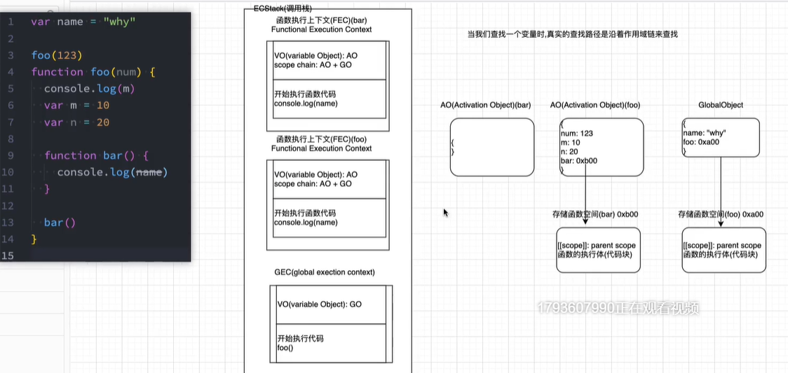

# 作用域和内存

解析和执行过程。

函数的父级作用域是在定义时就确定的，和它的调用位置是没有关系的。



### 原始值和引用值

#### 原始值

原始值：六种基本数据类型为原始值

特点：原始值不能有属性

####  引用值

引用值：Object为引用值

特点：引用值可以添加动态属性，而原始值不可以

例如：

```js
 	let person = new Object();
	person.name = '王五';
	console.log(person.name); //王五
```

### 复制值

#### 原始值的复制值

复制后的值是独立的，两个值不相互影响。

#### 引用值的复制值

复制的值实际上是复制的一个指针，两个变量都指向存储在堆内存中的同一个对象，会相互影响。

### 传递参数

传递参数是按值传递参数的，值会被复制到一个局部变量当中。

注意:  引用值作为参数复制时，只是复制了内存地址，指向的还是同一个对象。

```js
function setName(obj) {
    obj.name = "wang";
    obj = new Object();
    obj.name = "li";
    console.log(obj.name); //li
}

let person = new Object();
setName(person);
console.log(person.name); //wang
```

解释：局部变量obj复制了person对象的指针，指向了obj1 ，然后设置了name=‘wang‘。!

当obj重新指向一个新的object是，外部person的指向是不会变得，因为他们属于两个独立的变量。


因此，最终情况是，obj.name='li' ,person.name = 'wang'。

### 执行上下文与作用域

#### 上下文

全局上下文是最外层的上下文，在浏览器中，全局上下文为window对象。

每一个上下文都有一个关联的==变量对象==，里面存储了当前上下文的所有变量和函数。

执行函数时，当前函数的上下文会被推到一个上下文栈中，同时形成一个作用域链。

### 变量的声明

#### var的函数作用域声明

var声明的变量会被自动的添加到最接近的上下文，在函数中如果未声明，直接初始化，会被添加到全局上下文中，在函数外部也可以访问该变量。

```js
function setName(a, b) {
    sum = a + b;
    return sum;

}
setName(45, 11);
console.log(sum); //56
```

#### let块级作用域声明

1. 由最近一对{}定界，都属于块级作用域。
2. 重复声明会抛出SyntaxErrro错误。

#### 使用const的常量声明

1. 声明时必须同时赋值，一经声明后，在声明周期的任何时候都不能重新赋值。
2. 块级作用域
3. 赋值为对象的const变量不能再被重新赋值为其他引用值，但对象的键则不受限制。

```js
  const obj = {};
  obj=new Array(); //报错
  obj.name = 'wag'; //可以添加属性，但不能重新赋值
```

