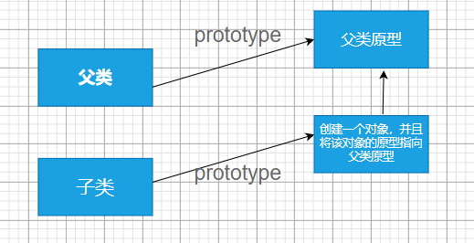
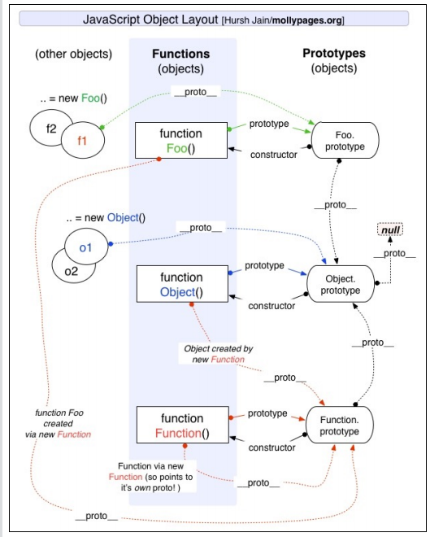

# 对象，类和面向对象编程

对象：对象由键值对组成的无序集合

### 对象的属性类型

#### 1.数据属性

数据属性包含一个保存数据的位置。值会从这个位置读取，也会写入到这个位置。

数据属性有一下四个特性：

1. [[Configurable]] : 表示属性是否可以通过delete删除并重定义，是否可以修改它的特性，以及是否可以把它改为访问器属性。默认是true
2. [[Enumberable]]：是否可以通过for-in循环返回，默认为true
3. [[Writable ]] ：表示属性的值是否可以被修改。默认为true
4. [[Value] ]: 包含属性实际的值

可以通过`Object.defineProperty( )`方法来修改属性的默认特性，接受三个参数：属性的对象，属性的名称，一个描述符对象

==注意：==当创建一个对象的新属性是，不设置该属性的特性时，默认都为false。

```js
//通过Object.defineProperty() 方法修改了默认特性
let person = {
    id: 1,
    age: 12,
    name: 'li',
    hobby: 'run'
};
//注意：configurable设置为false后，不能修改configurable和Enumerable两个特性，不然会报错
Object.defineProperty(person, 'name', {
    configurable: false,
    value: 'wang1'
});
console.log(person.name);
delete person.name;
console.log(person.name);
Object.defineProperty(person, 'name', {
    configurable: 'wang'
});
```

##### 2.访问器属性

访问器属性不包含数据值。它包含一个获取函数和设置函数，但两个函数不是必要的。

使用场景：

1. 隐藏某一个私有属性，不希望直接被外界使用。
2. 如果我们希望截获某一个属性他访问和设置值得过程，也会使用访问器属性描述符

4个特性：

1. [[Configurable]] : 表示属性是否可以通过delete删除并重定义，是否可以修改它的特性，以及是否可以把它改为数据属性。默认是true
2. [[Enumberable]]：是否可以通过for-in循环返回，默认为true
3. [[Set ]] : 设置函数，在写入属性时调用，默认值为undefined
4. [[Get]] : 获取函数，在获取属性时调用，默认值为undefined

使用场景：设置一个属性值来改变其他属性的值

```js
 Object.defineProperty(person, 'name', {
            get() {
                return this._name;
            },
            set(newvalue) {
                this._name = newvalue;
            }
        })
        console.log(person._name); //li
        person.name = 'wagn';
        console.log(person._name); //wagn
```

### 属性操作

定义多个属性：Object.defineProperties(对象，描述符)

读取属性的特性： Object.getOwnPropertyDescriptor(对象, 要取得其描述符的属性名)

读取整个对象的属性的特性：Object.getOwnPropertyDescriptors( 对象)（es8新增）

```js
  let book = {};
        //定义多个属性
        Object.defineProperties(book, {
                _year: {
                    value: 2017
                },
                edition: {
                    value: 1
                },
                year: {
                    get() {
                        return this._year
                    },
                    set(newValue) {
                        if (newValue > 2017) {
                            this._year = newValue;
                            this.edition += newValue - 2017
                        }
                    }
                }
            })
            //读取属性
        let descriptor = Object.getOwnPropertyDescriptor(book, '_year');
        console.log(descriptor.value);
        console.log(descriptor.configurable);
        console.log(descriptor.get);
        let descriptor1 = Object.getOwnPropertyDescriptor(book, 'year');
        console.log(descriptor1.value);
        console.log(descriptor1.enumerable);
        console.log(descriptor1.get);
		//读取整个对象的属性的特性
        console.log(Object.getOwnPropertyDescriptors(book));
```

### Object方法

1. 禁止对象扩展新属性：preventExtensions（）
2. 密封对象，不允许配置和删除属性 ：seal( )
3. 冻结对象，不允许修改现有属性： *freeze* ()
3. Object.keys(obj) ，返回obj对象的可枚举属性
3. Object.getOwnPropertyNames(obj)，返回一个由指定对象的所有自身属性的属性名(包括可枚举和不可枚举属性)

### 创建多个对象的方式

##### 1. new Object( ) 和{ }

缺点：创建同样的对象时，需要编写重复的代码；

##### 2. 工厂函数

通过工厂函数创建多个对象，实质上就是通过一个函数来创建对象，并将对象作为返回值返回。

例如：通过creatPerson()工厂函数创建对象

```js
function creatPerson(name, age, address) {
    var p = new Object();
    p.name = name;
    p.age = age;
    p.address = address;
    return p;
}

var p1 = creatPerson('张三', 12, '北京市');
var p2 = creatPerson('王五', 23, '郑州市');
```

弊端：通过工厂函数创建出来的对象都是Object类型，获取不到对象最真实的类型。

##### 3.构造函数

构造函数：js中的构造函数就是一个普通的函数，只是通过new 来调用时，可以当做构造函数来使用。

通过new调用函数执行如下操作：

1. 在内存中创建一个新的对象（空对象）；

2. 这个对象内部的[[prototype]]属性会被赋值为该构造函数的prototype属性；；

3. 构造函数内部的this，会指向创建出来的新对象；

4. 执行函数的内部代码（函数体代码）；

5. 如果构造函数没有返回非空对象，则返回创建出来的新对象；

例如：

```js
function Person(name, age, address) {
    this.name = name;
    this.age = age;
    this.address = address;
    this.eating = function() {
        console.log(this.name + '在吃东西');
    }
}
var p1 = new Person('王五', 12, '郑州市');
var p2 = new Person('李四', 13, '北京市');
```

缺点：每次创建对象时都要创建一个eating方法，这样会浪费内存。


### 对象原型

每一个对象内部都有一个[[prototype]]属性，这个特殊的属性可以指向另一个对象（隐式原型）

访问方式：1. __ proto __  ( 浏览器内置的方式，有兼容性问题)  

​				   2. Object.getPrototypeOf( obj)   （es6中新增的方法）

### 函数原型

所有的函数都有一个prototype属性，可以通过prototype来访问函数的原型。

```js
function foo(){}
 console.log(foo.prototype);
```

默认情况下原型上有construtor属性的，指向当前的函数对象（foo）,并且是不可枚举的（遍历对象上的属性时，不会遍历到原型上的属性）。

优化后的构造函数创建对象: 重写原型方法

```js
function Person(name, age, address) {
    this.name = name;
    this.age = age;
    this.address = address;
}
//重写原型对象
Pobject = {
    eating: function() {
        console.log(this.name + '在吃东西');
    },
    runing: function() {
        console.log(this.name + '在跑步');
    }
}
//constructor不可枚举
Object.defineProperty(Pobject, 'constructor', {
    enumerable: false, //不可枚举
    value: Person
})
Person.prototype = Pobject;
var p1 = new Person('王五', 12, '郑州市');
var p2 = new Person('李四', 13, '北京市');
console.log(p1);
console.log(p2);
p1.eating();
p2.runing();
```

直接在原型构造函数的原型上添加函数:

```js
function Person(name, age, address) {
  this.name = name;
  this.age = age;
  this.address = address;
}
//在原型上添加方法，实现对象的共享
Person.prototype.eating = function () {
  console.log(this.name + "在吃东西");
};
Person.prototype.runing = function () {
  console.log(this.name + "在跑步");
};

var p1 = new Person("王五", 12, "郑州市");
var p2 = new Person("李四", 13, "北京市");
console.log(p1);
console.log(p2);
p1.eating();
p2.runing();
```

### 面向对象

三大特征：封装，继承，多态

### 原型链

每一函数都它的显示原型，对象有它的隐式原型。

#### 函数原型：

function foo() {} 函数的原型链结构：

function foo() {} .prototype -> foo.prototype 

foo.prototype.__proto__ -> Object.prototype

Object.prototype.__proto__ -> null 

#### 对象原型：

obj ={ }对象的原型链结构：

obj.__proto__ -> Object.prototype

Object.prototype.__proto__ -> null 

==注意== : Object.prototype是原型链的尽头 ， Object.prototype对象的原型就是null

### 通过原型链继承

```js
//父类
function Person() {
    this.name = 'why'
}
Person.prototype.eating = function() {
    console.log(this.name + '吃饭');
}
//子类
function student() {
    this.sno = '123';
}
student.prototype = new Person();
student.prototype.studing = function() {
    console.log(this.name + '学习');
}
var stu = new student();
console.log(stu);
```

弊端：

1. 我们通过直接打印对象是看不到这个属性的；
2. 这个属性会被多个对象共享，如果这个属性是一个引用类型，那么就会造成问题；
3. 不能给Person传递参数，因为这个对象是一次性创建的（没办法定制化）；

### 盗用构造函数

```js
//父类
function Person(name, age, friends) {
this.name = name;
this.age = age;
this.friends = friends;
}
Person.prototype.eating = function() {
console.log(this.name + '吃饭');
}
//子类
function student(name, age, friends) {
Person.call(this, name, age, friends); //盗用构造函数
this.sno = '123';
}
```

### 组合式继承

使用原型链和盗用构造函数形成了组合式继承。

```js
//父类
function Person(name, age, friends) {
this.name = name;
this.age = age;
this.friends = friends;
}
Person.prototype.eating = function() {
console.log(this.name + '吃饭');
}
//子类
function student(name, age, friends) {
Person.call(this, name, age, friends);//盗用构造函数
this.sno = '123';
}

student.prototype = new Person(); //原型链继承

student.prototype.studing = function() {
console.log(this.name + '学习');
}
var stu = new student('王', 12, ['afe']);
var stu2 = new student('li1', 13, ['eee']);
```

弊端：

1. Person构造函数会被调用两次
2. stu的原型对象上会多出一些属性, 但是这些属性是没有存在的必要(当我们修改属性时，事实上是在当前对象上添加属性，而不是修改原型上的属性)

问题：**能不能直接让子类的原型对象 = 父类型的原型对象呢?** 

不要这么做, 因为这么做意味着以后修改了子类原型对象的某个引用类型的时候, 父类型原生对象的引用类型也会被修改. 

### 对象的原型式继承（寄生式继承）

```js
var obj = {
    name: '王'
}

//对象原型继承 下面三种方案都可以
//1.creat函数创建一个对象，该对象的原型指向obj
var newobj = Object.create(obj);
//2.创建一个对象，通过setPrototypeOf()函数将newobj的原型指向obj对象
function creatObj1(obj) {
    var newobj = {};
    Object.setPrototypeOf(newobj, obj);
    return newobj;
}
//3.通过构造函数Fun，将Fun的原型指向obj对象，因此new Fun（）构造函数创建的对象的原型也是指向Obj对象的
function creatObj2(obj) {
    function Fun() {};
    Fun.prototype = obj;
    var newobj = new Fun();
    return newobj;
}
```

### 寄生组合式继承

最优的继承方案：解决了借用构造函数继承产生多余属性的问题，并且不会调用两次父类

```js
//寄生组合式继承

//修改类型
//因为js检查类型是通过constructor来判断的，我们可以通过手动设置constructor来使js可以正确的查找到类型
function inheritPrototype(SubType, SuperType) {
  SubType.prototype = Object.create(SuperType.prototype);
  Object.defineProperty(SubType.prototype, "constructor", {
    configurable: true,
    enumerable: false,
    writable: true,
    value: SubType,
  });
}
//父类
function Person(name, age, friends) {
  this.name = name;
  this.age = age;
  this.friends = friends;
}

Person.prototype.running = function () {
  console.log("running~");
};

Person.prototype.eating = function () {
  console.log("eating~");
};

//子类
function Student(name, age, friends, sno, score) {
  Person.call(this, name, age, friends);
  this.sno = sno;
  this.score = score;
}
//创建一个对象，让这个对象的原型指向Person的原型对象,
//然后将这个的对象赋值给Student的原型
//避免了直接new Person()创建出来的对象会产生多余的属性

inheritPrototype(Student, Person);

Student.prototype.studying = function () {
  console.log("studying~");
};
//老师
function Teacher(name, age, friends, tno) {
  Person.call(this, name, age, friends);
  this.tno = tno;
}

inheritPrototype(Teacher, Person);

Teacher.prototype.teaching = function () {
  console.log("~教学");
};

var stu1 = new Student("王五", 16, ["老李"], 01, 99);
console.log(stu1);
stu1.studying();
stu1.running();

var stu2 = new Student("李四", 12, ["老王"], 02, 60);
console.log(stu2);
stu2.studying();
stu2.running();

var teacher1 = new Teacher("王老师", 45, ["李老师"], 003);
console.log(teacher1);
teacher1.teaching();
teacher1.running();

```

实现思路：利用一个对象，我们可以使子类创建出来的对象使用父类原型上的方法。并且借用父类构造函数，实现变量的初始化。并且复用父类原型上的函数了。




### 对象方法

**hasOwnProperty**： 对象是否有某一个属于自己的属性（不是在原型上的属性）

```js
const object1 = {};
object1.property1 = 42;

console.log(object1.hasOwnProperty('property1'));
```

in  ：判断某个属性是否在某个对象或者对象的原型上

```js
const car = { make: 'Honda', model: 'Accord', year: 1998 };

console.log('make' in car);
```

**instanceof**： 用于检测构造函数的prototype属性是否存在某个实例对象的原型链上 

```js
function Car(make, model, year) {
  this.make = make;
  this.model = model;
  this.year = year;
}
const auto = new Car('Honda', 'Accord', 1998);

console.log(auto instanceof Car);
// expected output: true

console.log(auto instanceof Object);//true
```

**isPrototypeOf**： 用于检测一个对象是否出现在另一个对象的原型链上

```js
function baz() {}
function foo() {}

foo.prototype = Object.create(baz.prototype);
//判断baz.prototype是否存在foo.prototype的原型链上
console.log(baz.prototype.isPrototypeOf(foo.prototype));
```

### 原型继承关系

```js
//foo的显示原型prototype指向自己的原型对象
//函数也是对象，也有隐式原型（__proto__），foo函数对象是由Function函数创建的，所以指向Function.prototype
function foo() {}
//fn的原型指向foo函数的原型
var fn = new foo();

console.log(fn.__proto__ === foo.prototype); //true
console.log(foo.__proto__ === Function.prototype); //true

//foo.prototype也是对象，所以原型指向Object.prototype
console.log(foo.prototype.__proto__ === Object.prototype); //true

//Function函数也是函数，有自己的prototype和__proto__
//因为Function是由自己创建的，所以prototype === __proto__
console.log(Function.prototype === Function.__proto__); //true

//Function.prototype是对象，所以Function.prototype.__proto__指向Object.prototype
console.log(Function.prototype.__proto__ === Object.prototype); //true

//Object函数也是由Function函数创建的，所以__proto__指向Function.prototype
//Object函数也有自己的prototype
console.log(Object.__proto__ === Function.prototype); //true

var obj = {};
//obj对象是由Object()函数创建的，所以___proto__ 指向Object.prototype
console.log(obj.__proto__ === Object.prototype); //true
```

经典原理图：



