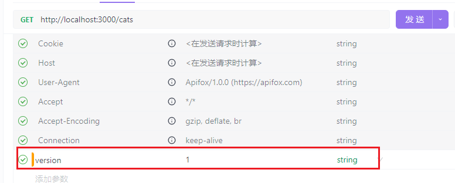

# NestJS 路由版本控制指南

在构建 RESTful API 时，随着业务需求的变化和功能的迭代，API 的接口定义通常需要进行调整。为了保持向后兼容性并支持不同客户端的需求，**路由版本控制**成为了一个重要的实践。

NestJS 提供了多种方式来实现路由的版本控制，包括 **URL 版本控制**、**请求头版本控制** 和 **查询参数版本控制**。本文将详细介绍如何在 NestJS 中实现这些版本控制策略，并涵盖控制器版本、路由版本以及默认版本的配置。

---

## 一、版本控制的几种类型

### 1. URL 版本控制（推荐）

通过在 URL 路径中加入版本号来区分不同版本的 API。

#### 示例：

- `/api/v1/users`
- `/api/v2/users`

#### 优点：

- 简单直观，易于调试。
- 适合前后端分离项目或对外公开的 API。

#### 缺点：

- 不适合使用缓存代理的场景。

### 2. 请求头版本控制

通过 HTTP 请求头中的字段指定 API 版本。

#### 示例请求头：

```typescript
// 设置 API 版本
app.enableVersioning({
  type: VersioningType.HEADER,
  header: 'version',
});
```



#### 优点：

- 更加灵活，适用于内部服务间通信。
- 可与缓存机制结合使用。

#### 缺点：

- 需要客户端支持设置自定义 Accept 头。
- 不如 URL 明显，调试略复杂。

## 二、控制器级别的版本控制

NestJS 允许我们在控制器级别上定义版本，这意味着一个控制器可以处理特定版本的请求。

```typescript
import { Controller, Get, Version } from '@nestjs/common';

@Controller({ path: 'users', version: '1' })
export class UsersControllerV1 {
  @Get()
  findAll(): string {
    return 'This is version 1 of the users endpoint';
  }
}

@Controller({ path: 'users', version: '2' })
export class UsersControllerV2 {
  @Get()
  findAll(): string {
    return 'This is version 2 of the users endpoint';
  }
}
```

### 注册模块：

```typescript
import { Module } from '@nestjs/common';
import { UsersControllerV1 } from './users.controller.v1';
import { UsersControllerV2 } from './users.controller.v2';

@Module({
  controllers: [UsersControllerV1, UsersControllerV2],
})
export class UsersModule {}
```

## 三、路由级别的版本控制

### 使用 `@Version()` 装饰器：

除了控制器级别外，也可以在具体路由方法上指定版本。

```typescript
import { Controller, Get, Post, Version } from '@nestjs/common';

@Controller('users')
export class UsersController {
  @Get()
  @Version('1')
  findAllV1(): string {
    return 'This is version 1 of GET /users';
  }

  @Get()
  @Version('2')
  findAllV2(): string {
    return 'This is version 2 of GET /users';
  }

  @Post()
  @Version(['1', '2'])
  create(@Body() createUserDto: any): string {
    return 'This POST route supports both version 1 and 2';
  }
}
```

此方式适用于同一个路径下不同版本的方法逻辑差异较大的情况。

---

## 四、设置默认版本

可以通过全局配置为所有未指定版本的请求设置默认版本。

### 在main.ts中设置默认版本

```typescript
import { NestFactory } from '@nestjs/core';
import { AppModule } from './app.module';
import { VersioningType } from '@nestjs/common';

async function bootstrap() {
  const app = await NestFactory.create(AppModule);

  // 设置 API 版本
  app.enableVersioning({
    // type: VersioningType.URI, // 使用 URI 版本控制
    // defaultVersion: '1', // 默认版本
    type: VersioningType.HEADER, // 使用请求头版本控制
    header: 'version', // 请求头版本控制字段
  });

  await app.listen(process.env.PORT ?? 3000);
}

bootstrap();
```

---

## 五、总结

| 类型       | 控制器级别 | 路由级别 | 默认版本 |
| ---------- | ---------- | -------- | -------- |
| URL 版本   | ✅         | ✅       | ✅       |
| 请求头版本 | ✅         | ✅       | ✅       |

### 推荐实践：

- 对外开放的 API 建议使用 **URL 版本控制 + 控制器级别划分**。
- 内部服务建议使用 **请求头版本控制 + 路由级别划分**。
- 所有新开发的 API 应该明确指定版本，避免未来升级带来破坏性变更。
- 设置合理的默认版本以支持旧客户端。

通过合理使用 NestJS 提供的版本控制机制，可以更优雅地管理 API 演进过程，提升系统的可维护性和扩展性。

