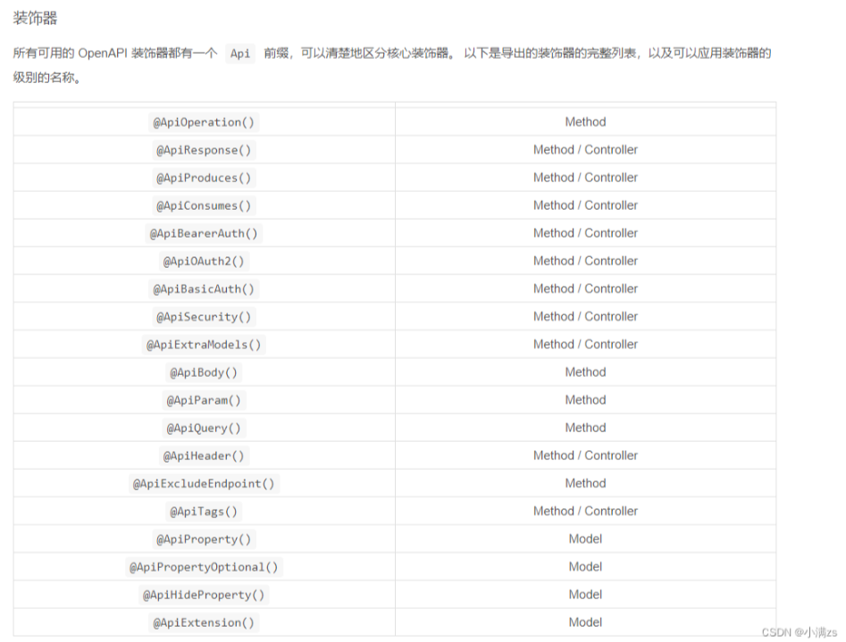

# NestJs 中使用 Swagger

## 安装 Swagger

```bash
npm install  @nestjs/swagger swagger-ui-express
```

## 创建 Swagger 配置文件

```typescript
import { DocumentBuilder, SwaggerModule } from "@nestjs/swagger";
async function bootstrap() {
  const app = await NestFactory.create<NestExpressApplication>(AppModule);
  const options = new DocumentBuilder()
    .setTitle("lz测试项目")
    .setDescription("lz测试项目接口文档")
    .setVersion("1")
    .build();
  const document = SwaggerModule.createDocument(app, options);
  SwaggerModule.setup("/api-docs", app, document);
  await app.listen(3000);
}
bootstrap();
```

访问地址：http://localhost:3000/api-docs

## 常用装饰器

在 NestJS 中，Swagger 装饰器用于自动生成 API 文档。这些装饰器主要来源于 `@nestjs/swagger` 包，帮助开发者描述控制器、方法、参数和模型等。以下是一些常用的 Swagger 装饰器及其用途：

1. **`@ApiModule`**

   - **用途**：为模块添加描述。
   - **案例**：
     ```typescript
     @ApiModule({
       name: "User Module",
       description: "用户管理模块",
     })
     @Module({})
     export class UserModule {}
     ```

2. **`@ApiController`**

   - **用途**：为控制器添加描述。
   - **案例**：
     ```typescript
     @ApiController("users", "用户相关接口")
     @Controller("users")
     export class UsersController {}
     ```

3. **`@ApiOperation`**

   - **用途**：描述具体的操作（方法）。
   - **案例**：
     ```typescript
     @ApiOperation({ summary: '获取所有用户', description: '返回系统中的所有用户信息' })
     @Get()
     findAll(): string[] {
       return ['User1', 'User2'];
     }
     ```

4. **`@ApiQuery`**

   - **用途**：描述 GET 请求中的查询参数。
   - **案例**：
     ```typescript
     @ApiQuery({ name: 'name', required: false, description: '用户的姓名' })
     @Get()
     find(@Query('name') name?: string): string[] {
       return name ? [`User: ${name}`] : ['User1', 'User2'];
     }
     ```

5. **`@ApiParam`**

   - **用途**：描述路径参数。
   - **案例**：
     ```typescript
     @ApiParam({ name: 'id', type: 'string', description: '用户唯一标识' })
     @Get(':id')
     findOne(@Param('id') id: string): string {
       return `User ID: ${id}`;
     }
     ```

6. **`@ApiProperty `**

   - **用途**：描述 Post 请求 body 参数
   - **案例**：

     ```typescript
     export class CreateGuardDto {
       @ApiProperty({ description: "姓名", example: "lz" })
       name: string;
       @ApiProperty({ description: "年龄", example: 18 })
       age: number;
     }
     ```

7. **`@ApiResponse`**

   - **用途**：描述接口响应。
   - **案例**：
     ```typescript
     @ApiResponse({ status: 200, description: '成功返回用户列表', type: [String] })
     @ApiResponse({ status: 404, description: '未找到用户' })
     @Get()
     findAll(): string[] {
       return ['User1', 'User2'];
     }
     ```

8. **`@ApiModel` 和 `@ApiModelProperty`**

   - **用途**：描述数据模型及其属性。
   - **案例**：

     ```typescript
     @ApiModel({ description: "用户数据传输对象" })
     export class CreateUserDto {
       @ApiModelProperty({ example: "john_doe", description: "用户名" })
       username: string;

       @ApiModelProperty({ example: "123456", description: "密码" })
       password: string;
     }
     ```

9. **`@ApiBearerAuth`**
   - **用途**：启用 Bearer 认证。
   - **案例**：
     ```typescript
     @ApiBearerAuth()
     @Get('secure')
     secureEndpoint(): string {
       return 'This is a secure endpoint';
     }
     ```

## 其他装饰器



参考文章：https://xiaoman.blog.csdn.net/article/details/127181578

```

```
