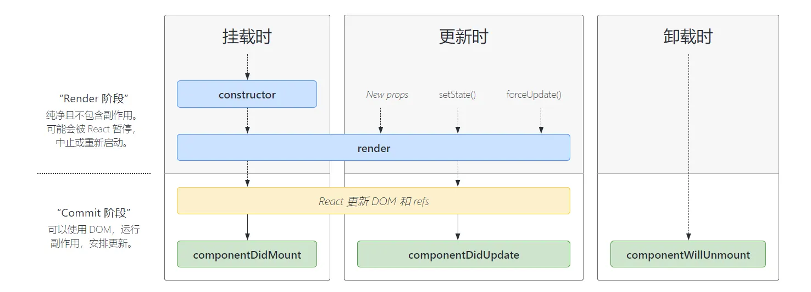

### 事件函数中的this问题
在react中事件的回调this是指向undefined。因此我们需要手动处理this问题，让this指向react组件实例。

```javascript
class Toggle extends React.Component {
  constructor(props) {
    super(props);
    this.state = {isToggleOn: true};

    // 为了在回调中使用 `this`，这个绑定是必不可少的
    this.handleClick = this.handleClick.bind(this);
  }

  handleClick() {
    this.setState(state => ({
      isToggleOn: !state.isToggleOn
    }));
  }

  render() {
    return (
      <button onClick={this.handleClick}>
        {this.state.isToggleOn ? 'ON' : 'OFF'}
      </button>
    );
  }
}

ReactDOM.render(
  <Toggle />,
  document.getElementById('root')
);
```


### jsx
书写规范：

1. 只能有一个根元素
2. 为了方便阅读，我们通常在jsx的外层包裹一个小括号()


jsx中插入的类型分类：

1. Number，String，Array会直接显示
2. Null，undefined,Boolean 会显示为空白
3. Object类型不能作为子元素直接插入{}中

属性绑定：

```jsx
  {/* 绑定age变量 */}
  <div className={age}>{count}</div>

  {/* 绑定style */}
  <div className={age} style={{color:'red'}}>{count}</div>
```

### usestate更改状态
更改后的age为2.

```javascript
import { useState } from "react";

export default function App () {
  const [age,setage] = useState(0);

  const click1 = () =>{
    setage(age+1);
    if(true){
      setage(age+2);
    }
  }

  const click2 = () =>{
    setage(()=>age+1);
    if(true){
      setage(()=>age+2);
    }
  }
  return (
    <div>
      <button onClick={click1}>one</button>
      <button onClick={click2}>tow</button>
      <span>{age}</span>
    </div>
  )
}

```

### setState的用法
setState改变状态是异步的。

**问题：为什么setState设计为异步更新？**

1. 可以显著的提升性能。（获取多个更新后，进行批量更新）
2. 如果同步更新了state,但是还没有执行render，会造成state和props不同步的问题。


传入对象时，由于是setState会将多了setState进行合并，所以setState对象中使用的原来的值都是0。

传入函数后，函数会被加入异步队列当中，会依次执行，那么两个异步函数中的state.age是不一样的。

```javascript
//执行click1 后 age变为了2
//执行click2 后 age变为了3

import { Component } from "react";

interface State {
  age: number;
}

export default class ClassComponents extends Component<{}, State> {
  state: State = {
    age: 0
  }

  click1 = () =>{
    this.setState({
      age:this.state.age+1
    },()=>{
      /* 该回调保证在界面已经根据最新的 state 完成更新后才被调用，
      适合用来处理依赖最新 state 的 DOM 操作或副作用逻辑。 */
      console.log(this.state.age); // 2
    });
    if(true){
      this.setState({
        age:this.state.age+2
      });
    }
  }

  click2 = () =>{
    this.setState((state,props)=>({
      //state.age =0
      age: state.age+1 
    }));
    if(true){
      this.setState((state,props)=>(
        //state.age =1
       {age: state.age+2}
      ));
    }
  }
  render (){
    return (
      <div>
      <button onClick={this.click1}>one</button>
      <button onClick={this.click2}>tow</button>
      <span>{this.state.age}</span>
    </div>
    )
  }
}


```

由于setState是异步的，在改变state后，如果想等到state被修改之后再来使用，可以使用setState()的第二个参数callback().

```jsx
add = ()=>{
  this.setState({count:this.state.count+1},()=>{
    // state完成合并后进行的回调
    console.log(this.state.count);
  })
  console.log(this.state.count);
}
```

### 生命周期


[https://projects.wojtekmaj.pl/react-lifecycle-methods-diagram/](https://projects.wojtekmaj.pl/react-lifecycle-methods-diagram/)

函数组件模拟生命周期方法：

只需要在 useEffect 的依赖数组中传入一个空数组 []。这样，该副作用只会在组件挂载后运行一次。


```jsx
useEffect(() => {
  console.log('代码只会在组件挂载后执行一次')
}, [])
```

模拟更新阶段的生命周期方法：

通过将依赖项放入依赖数组中，useEffect 可以在依赖项更改时执行。如果你省略了依赖数组，副作用将在每次渲染后执行。

```jsx
// 注意这里没有提供依赖数组
useEffect(() => {
  console.log('代码会在组件挂载后以及每次更新后执行')
})
// 特定依赖更新时执行
useEffect(() => {
  console.log('代码会在 count 更新后执行')
}, [count])
```

模拟卸载阶段的生命周期方法：

在 useEffect 的函数中返回一个函数，该函数会在组件卸载前执行。

```jsx
useEffect(() => {
  return () => {
    console.log('代码会在组件卸载前执行')
  }
}, [])
```

### 组件通信
#### 父传子：props
使用prop-types来进行设置props的类型和默认值

```jsx
import React from "react";

// 类组件
class Header extends Component {
  constructor(props) {
    super(props);
    console.log(props);
  }
  render() {
    return <div>Header</div>;
  }
}

// 函数组件
function Header(props) {
  console.log(props);
  return (
    <>
      <div>{props.age}</div>
      <div>fewa</div>
    </>
  );
}
```

<font style="color:#E8323C;">注意</font>：jsx语法中不可以直接展示对象数据，会报错

#### 子传父
相当于我们父组件给子组件传递一个函数props，然后我们在子组件中调用传入的函数，传入值后父组件进行接受。

父组件：

```jsx
import React, { Component } from 'react'
import Header from './components/Header';


export class App extends Component {
  state={
    count:100
  }
  render() {
    return (
      <>
        <div>{this.state.count}</div>
        <Header add={(value)=>{this.setState({count:this.state.count + value})}}></Header>
      </>
    )
  }
}
```

子组件：

```jsx
import React from "react";

function Header(props) {
  console.log(props);
  return (
    <>
      <button onClick={() => props.add(1)}>+1</button>
      <button onClick={() => props.add(5)}>+5</button>
      <button onClick={() => props.add(10)}>+10</button>
    </>
  );
}

export default Header;
```


### 插槽的实现
#### 1.通过children实现
1. 传入多个子元素时，children是一个数组。
2. 传入单个元素时，children就是传入的那个元素。

```jsx
// 父组件
export class App extends Component {
  state={
    count:100
  }
  render() {
    return (
      <>
        <div>{this.state.count}</div>
        <Header>
          <button>哈哈</button>
          <span>嘿嘿嘿</span>
          <button>feawfe</button>
        </Header>
      </>
    )
  }
}

// 子组件
function Header(props) {
  console.log(props);
  const {children} = props;
  return (
    <>
      <div className="left">{children[0]}</div>
      <div className="center">{children[1]}</div>
      <div className="right">{children[2]}</div>
    </>
  );
}
```

#### 2.通过props传递元素实现
```jsx
// 如组件直接掺入一个标签prop
<Header leftSlot = {<button>哈哈</button>}/>


// 子组件使用它
function Header(props) {
  console.log(props);
  return (
    <>
      <div className="left">{props.leftSlot}</div>
    </>
  );
}

```

#### 作用域插槽实现
```jsx

// 父组件传入一个prop函数，可以通过参数接受到子组件中的值
render() {
  return (
    <>
      <div>{this.state.count}</div>
      <Header leftSlot = {(item)=><button>{item}</button>}/>
    </>
  )
}

// 子组件
function Header(props) {
  console.log(props);
  return (
    <>
      <div className="left">{props.leftSlot("自定义")}</div>
    </>
  );
}
```


### SCU优化
默认情况下，我们在调用setState之后，无论state中的值是否改变，都会执行render函数。如果值没有改变，那么这就会造成性能下降的问题。因此可以通过生命周期shouldComponentUpdate来判断当值发生改变以后再执行render函数。但是如果我们手动判断是一件非常麻烦的事情。react为我们提供了PureComponent 和memo来实现这样的性能优化。

#### PureComponent

定义：PureComponent 是 React 提供的一个基类组件。它的核心思想是：如果组件-的 props 和 state 没有发生“浅比较”（shallow comparison）的变化，则不会重新渲染组件。

特点：
- 继承自 Component：你需要让组件继承自 React.PureComponent 而不是 React.Component。
- 自动进行浅比较：React 内部会自动对 props 和 state 进行浅层比较。如果发现没有变化，就阻止组件的 render 方法执行。
- 适用于类组件：只能用于类组件（Class Components）。
- 浅比较限制：对于深层嵌套的对象或数组，浅比较可能无法正确检测到变化。例如，修改了对象内部的属性或数组内部的元素，浅比较可能认为对象没有改变。
- 手动控制：如果需要更复杂的比较逻辑，可以通过实现 shouldComponentUpdate 生命周期方法来覆盖默认的浅比较行为。

```javascript
import React, { PureComponent } from 'react'
import Header from './components/Header';

// 继承pureComponent
export class App extends PureComponent {
  state={
    count:100
  }
  add = ()=>{
    this.setState({count:this.state.count+1})
  }
  render() {
    console.log('app.js');
    return (
      <>
        <div>{this.state.count}</div>
        <button onClick={this.add}>+1</button>
        <Header></Header>
      </>
    )
  }
}

export default App;

```

#### memo

定义：memo 是 React 提供的一个高阶函数，用于对函数组件进行性能优化。它的核心思想是：如果组件的 props 没有发生“浅比较”（shallow comparison）的变化，则不会重新渲染组件。

特点：
- 应用于函数组件：memo 主要用于函数组件（Function Components）。
- 自动进行浅比较：和 PureComponent 类似，React 会自动对传入的 props 进行浅层比较。
- 可自定义比较函数：你可以传递第二个参数给 memo，它是一个比较函数，用来决定是否需要重新渲染。这个函数接收 prevProps 和 nextProps 作为参数，返回 true 表示不需要更新，返回 false 表示需要更新。
- 灵活性：相比 PureComponent，memo 更加灵活，因为它可以用于函数组件，并且可以自定义比较逻辑。

```jsx
import React, {memo} from "react";

// 使用高阶函数memo，返回一个组件
const Header = memo(function (props) {
  console.log("header.js");
  return (
    <>
      <div>hahahah</div>
    </>
  );
});
export default Header;
```

### ref绑定组件

#### ref绑定类组件
ref可以绑定到类组件上，但是不能绑定到函数组件上。因为函数组件不存在实例。

```javascript
export class App extends PureComponent {
  state={
    count:100,
    list:[1,2,4,3]
  }
  constructor(){
    super()
    this.forwardCpm = createRef()
  }
  add = ()=>{
    console.log(this.forwardCpm);
  }
  render() {
    console.log('app.js');
    return (
      <>
        <button onClick={this.add}>+1</button>
        <Header ref={this.forwardCpm}></Header>
      </>
    )
  }
}
```

组件实例：


函数组件可以通过forwardRef来绑定到子组件中的某一个元素上。

```javascript
// 父组件
import React, { PureComponent,createRef} from 'react'
import Header from './components/Header';

export class App extends PureComponent {
  state={
    count:100,
    list:[1,2,4,3]
  }
  constructor(){
    super()
    this.forwardCpm = createRef()
  }
  add = ()=>{
    console.log(this.forwardCpm);
  }
  render() {
    console.log('app.js');
    return (
      <>
        <button onClick={this.add}>+1</button>
        <Header ref={this.forwardCpm}></Header>
      </>
    )
  }
}


export default App;

```

```jsx
// 子组件
import React, {memo, forwardRef} from "react";

const Header = forwardRef((props, ref) => (
  <>
    <div ref={ref}>hahahah</div>
  </>
));
export default Header;
```

#### 函数组件useRef绑定组件

```jsx
import { useRef, useEffect } from 'react'
import ClassComponents from './components/classComponents'

function App() {
  const inputRef = useRef<HTMLInputElement>(null)
  const classRef = useRef<ClassComponents>(null)

  const focusInput = () => {
    if (inputRef.current) {
      inputRef.current.focus()
    }
  }

  useEffect(()=>{
    console.log(classRef.current)
  },[])

  return (
    <>
      <ClassComponents ref={classRef}/>
      <input ref={inputRef} />
      <button onClick={focusInput}>Focus Input</button>
    </>
  )
}

export default App
```


### 高阶组件
#### 1.增强props
使用场景，通过高阶组件对context进行增强

**app.jsx**

```javascript
import React, { PureComponent} from 'react'
import Header from './components/Header';
import ThemeContext from './context/ThemeContext';
export class App extends PureComponent {
  state={
    list:[],
  }
  render() {
    console.log('app.js');
    return (
      <>
        <ThemeContext.Provider value={{color:'red',size:'12px'}}>
          <Header></Header>
        </ThemeContext.Provider>
      </>
    )
  }
}

export default App;
```

**withComponse.js 高阶组件**

```javascript
import ThemeContext from "./context/ThemeContext"


export function withComponse(WrapperCpm){
  console.log(WrapperCpm);
  return (props)=>{
   return ( 
    <ThemeContext.Consumer>
      {(value)=>{
        return (
          <WrapperCpm {...value} {...props}></WrapperCpm>
        )
      }}
    </ThemeContext.Consumer>
  )
  }
}
```

**Header组件**

```jsx
import React, {Component} from "react";
import {withComponse} from "../withComponse";
class Header extends Component {
  render() {
    console.log("header");
    return <div>{this.props.color}-fewafeeee</div>;
  }
}

// 调用withComponse函数进行context增强
export default withComponse(Header);
```


#### 2.拦截组件，验证登录
```javascript
export function with_auth(WrapperCpm){
  return (props)=>{
    const auth = localStorage.getItem('auth')
    if(auth){
      return <WrapperCpm></WrapperCpm>
    }else{
      return <div>请登录！</div>
    }
  }
}
```


#### 3.组件渲染耗费的时间
```javascript
import { Component } from "react";
export function withRenderTIme(WrapperCpm){
  console.log(WrapperCpm);
  return class extends Component{
    state = {
      startTime:0,
      spendTime:0
    }
    componentWillMount(){
      let newTime = new Date().getTime()
      this.setState({startTime:newTime})
    }
    componentDidMount(){
      let nowTime = new Date().getTime()
      let spendTime = nowTime - this.state.startTime;
      this.setState({spendTime})
    }
    render(){
      return (
       <>
        <div>{WrapperCpm.name}渲染花费了{this.state.spendTime}毫秒</div>
          <WrapperCpm></WrapperCpm>
        </>
      )
    }
  }
}
```

### 编写css
#### 1.css modules
将css文件命名为 【name】.module.css


```javascript
import React, { useState } from 'react'
import  homeStyle from './home.module.css';


class Home extends React.Component {
  constructor(){
    super()
    this.state = {
      name:'fewa'
    }
  }


  render(){
    return (
      // 使用css module
      <div className={homeStyle.title}>Home组件呀</div>
    )
  }
}
```

#### 2.css in js
使用styled-components来实现使用js来编写css

[styled-components](https://styled-components.com/)


### classNames添加类名
使用classNames库来添加类更方便。

[https://github.com/JedWatson/classnames](https://github.com/JedWatson/classnames)


