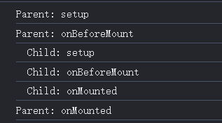

# vue3基础

#### methods中的函数不能为箭头函数

methods中的函数不能使用箭头函数，使用箭头函数后，vue不能对函数的this进行正确的绑定。

#### v-bind绑定

如果绑定的值是 `null` 或 `undefined`，那么该 attribute 将不会被包含在渲染的元素上。

v-bind可以直接绑定一个对象，把一个对象的所有属性绑定到元素上。

```js
 <div v-bind="info"></div>
 
 //info
  data() {
  	return {
      info: {
      name: "one",
      age: 12,
  		},
 	 };
  },
```

#### v-on通过对象绑定事件

```html
 //绑定了click和mou
<div class="box" v-on="{click:dclick,mouseup:dmouseup}">你好啊</div>
```

#### v-show注意点

不能在template元素上使用v-show。

### watch使用注意点

一、当我们要监听对象的某一个值时，我们可以这样写：监听info对象的name属性

```js
 watch: {
     "info.name": function (newval, oldval) {
         console.log(newval, oldval);
     },
 },
```

注意：这种方式是无法监听像user[0].name数组中对象的值得。

二、除了options这种写法外，vue还给我们提供了$watch这种实例方法来监听数据的变化。这个函数放回一个unwatch函数，调用unwatch方法，我们可以取消相应的监听。

```js
created() {
    //监听info对象的变化
    var unwatch = this.$watch("info", function (newValue, oldValue) {
        console.log(newValue, oldValue);
    });
    
    //如果我们你监听嵌套属性，我们需要利用函数的返回值来作为监听的值
    var unwatch = this.$watch(
        () => this.info.name,
        function (newValue, oldValue) {
            console.log(newValue, oldValue);
        }
    );
    //也可以监听数组中对象值的变化
      var unwatch = this.$watch(
            () => this.user[0].name,
            function (newValue, oldValue) {
              console.log(newValue, oldValue);
            }
          );
},
```

composition API 中的watch，监听响应属性时要使用一个getter函数；因为a.n是一个是普通值，监听它没有意义。

```js
watch(
    () => a.n,
    function () {
    	console.log("123");
    }
);
```

### v-model

v-model绑定的值默认都是String类型。

1. 当type为number，但是初始值为String类型时，msg始终为字符型。
2. 当type为number，但是初始值为Number类型时，msg始终为Number类型。
3. 当type为text，但是初始值为String类型时，msg始终为String类型。
4. 当type为text，但是初始值为Number类型时，后面只要输入新内容，msg始终为String类型。

```js
<input type="number" v-model="msg" />

data() {
    return {
    	msg: "100",
    };
},
```

### 组件渲染


### reactive()和ref()是实现的区别

reactive()是通过Proxy来实现的。

ref() 是通过class中的set,get来实现的。

如果是一个对象，会使用reactive()代理这个对象。

ref包裹整个对象。

```js
 constructor(value: T, public readonly __v_isShallow: boolean) {
    this._rawValue = __v_isShallow ? value : toRaw(value)
    this._value = __v_isShallow ? value : toReactive(value)
  }
```


### 父子组件生命周期执行顺序

总结：先挂载子组件，再挂载子组件

