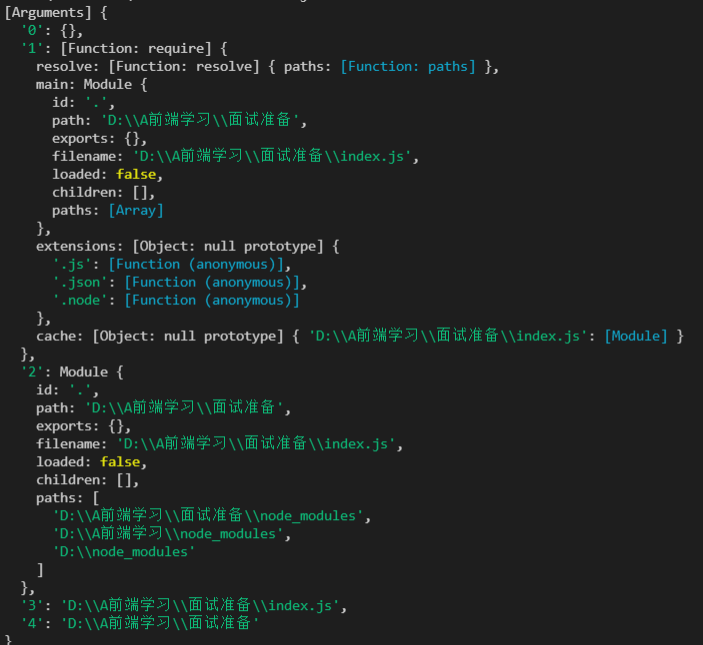

# arguments

arguemnt是一个类数组。

特点：

1. 有length属性
2. 可以通过index来遍历
3. 可以通过index索引来获取值
4. arguments.callee()获取当前函数

### arguements的基本使用

 arguments：类数组对象中(长的像是一个数组, 本质上是一个对象)

```js
 	//1.参数长度
    console.log(arguments.length);
    //2，.根据索引值获取某一个参数
    console.log(arguments[2]);
    //3.callee获取当前arguments所在的函数
    console.log(arguments.callee);
```

### arguments转为数组

```js
function foo() {
  console.log(arguments);
  //1.遍历转化
  let arr = [];
  for (const item of arguments) {
    arr.push(item);
  }
  console.log(arr);
  //2.slice方式
  const arr2 = Array.prototype.slice.call(arguments);
  const arr5 = [].slice().call(arg)
  console.log(arr2);
  //3.es6以后
  const arr3 = [...arguments];
  const arr4 = Array.from(arguments);
  console.log(arr3, arr4);
}
```

### 箭头函数没有arguments

箭头函数没有arguments，在箭头函数中它会向上层作用域查找argments。

箭头函数中是通过剩余参数来获取参数的

```js
var baz = (one, ...args) => {
    console.log(args);//[2,3,4]
}
baz(1, 2, 3, 4);
```

浏览器中：全局作用域是没有arguments的。

node中：一个js文件相当于一个模块，是由arguments的。



### slice方法实现

slice方法：slice(start,end)是数组的一个内置方法，遍历数组，返回新的数组。

slice()函数的内部实现：

```js
Array.prototype.lzslice = function (start, end) {
  const args = this;
  start = start || 0;
  end = end || this.length;
  let arr = [];
  for (let i = start; i < end; i++) {
    arr.push(args[i]);
  }
  return arr;
};
```
