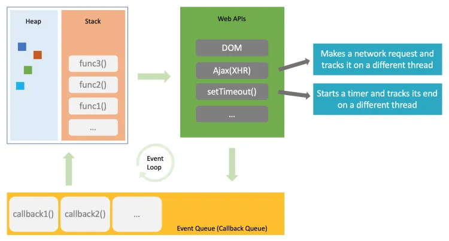
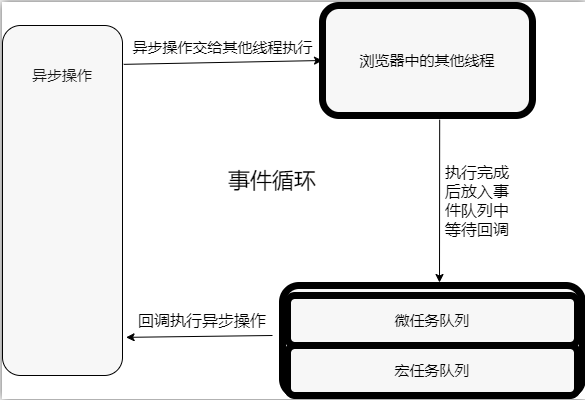

# 事件循环

## 为什么JavaScript是单线程？
JavaScript语言的一大特点就是单线程，也就是说，同一个时间只能做一件事。那么，为什么JavaScript不能有多个线程呢？这样能提高效率啊。

JavaScript的单线程，与它的用途有关。作为浏览器脚本语言，JavaScript的主要用途是与用户互动，以及操作DOM。这决定了它只能是单线程，否则会带来很复杂的同步问题。比如，假定JavaScript同时有两个线程，一个线程在某个DOM节点上添加内容，另一个线程删除了这个节点，这时浏览器应该以哪个线程为准？

所以，为了避免复杂性，从一诞生，JavaScript就是单线程，这已经成了这门语言的核心特征，将来也不会改变。

为了利用多核CPU的计算能力，HTML5提出Web Worker标准，允许JavaScript脚本创建多个线程，但是子线程完全受主线程控制，且不得操作DOM。所以，这个新标准并没有改变JavaScript单线程的本质。

## 事件循环基本概念

javascript的代码是在一个单独的线程中执行的，这就意味着代码是同步执行的，如果遇到阻塞，则代码将不能继续向下执行。

但是在我们的javascript中，有很多的异步代码，实际上这些代码不是由我们的js线程来完成的，是通过其他浏览器线程来完成耗时的操作，到等到要执行的时候，js线程只负责回调相应的异步代码，再放入js的执行栈中执行代码。

补充说明：浏览器的内核是多线程的，常驻线程有浏览器 GUI 渲染线程、JavaScript 引擎线程、浏览器定时触发器线程、浏览器事件触发线程、浏览器 http 异步请求线程

**`事件循环**：异步操作交给其他线程执行，执行完成后放入执行队列等待js线程的回调，整个执行过程就是事件循环。

### 宏任务和微任务

**事件循环中并非只维护着一个队列，事实上是有两个队列：**

宏任务队列（macrotask queue）：ajax、setTimeout、setInterval、DOM监听、UI Rendering等 

微任务队列（microtask queue）：Promise的then回调、 Mutation Observer API、queueMicrotask()等 

**执行顺序：** 

1. main script中的代码优先执行（普通的同步代码）
2. 执行微任务
3. 在执行宏任务之前，要保证所有的微任务都执行完毕。

### Node事件循环

**一次完整的事件循环Tick分成很多个阶段：**

1. **定时器（Timers）** :本阶段执行已经被 setTimeout() 和 setInterval() 调度的回调函数
2. **待定回调（Pending Callback）**：对某些系统操作（如TCP错误类型）执行回调，比如TCP连接时接收到 ECONNREFUSED
3. **idle, prepare**：仅系统内部使用
4. **轮询（Poll）**：检索新的 I/O 事件；执行与 I/O 相关的回调；
5. **检测（check）**：setImmediate() 回调函数在这里执行
6. **关闭的回调函数**：一些关闭的回调函数，如：socket.on('close', ...)

#### node中的宏任务和微任务

 **宏任务（macrotask）**：setTimeout、setInterval、IO事件、setImmediate、close事件；

**微任务（microtask）：**Promise的then回调、process.nextTick、queueMicrotask； 

node中的宏任务队列和微任务队列又分了好几个：

微任务队列：

1. next tick queue：process.nextTick；
2. other queue：Promise的then回调、queueMicrotask；

宏任务队列：

1. timer queue: setTimeout , setInterval
2. poll queue: IO事件；
3. check queue: setImmediate
4. close queue: colse 事件

所以执行顺序为：

1. next tick queue：process.nextTick；

2. other queue：Promise的then回调、queueMicrotask；

3. timer queue: setTimeout , setInterval

4. poll queue: IO事件；

5. check queue: setImmediate

6. close queue: colse 事件

   

   

   

   

