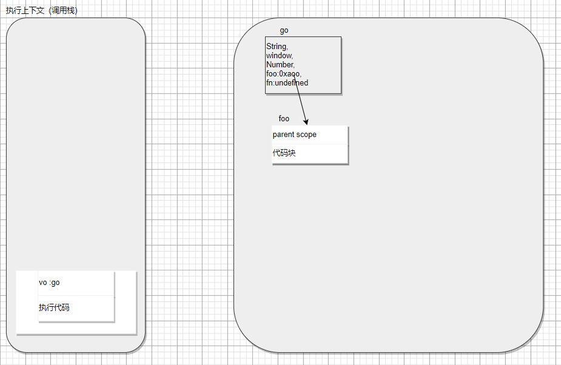
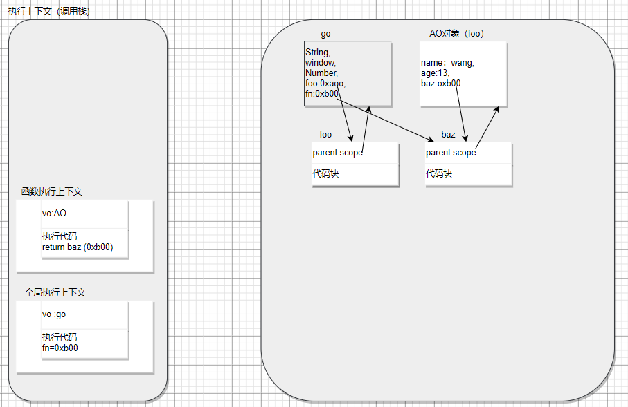
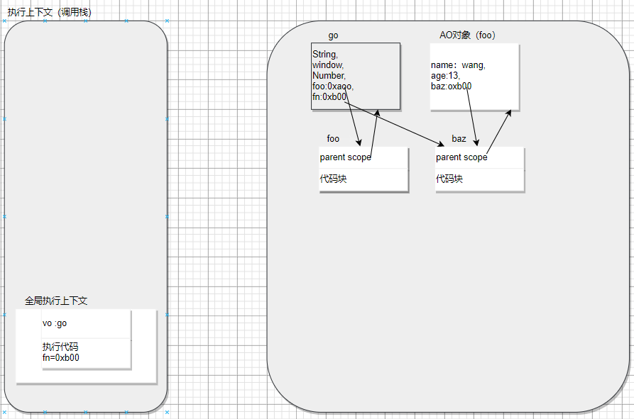
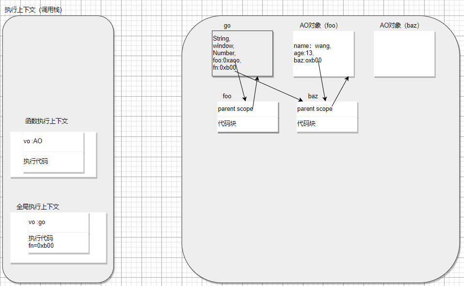
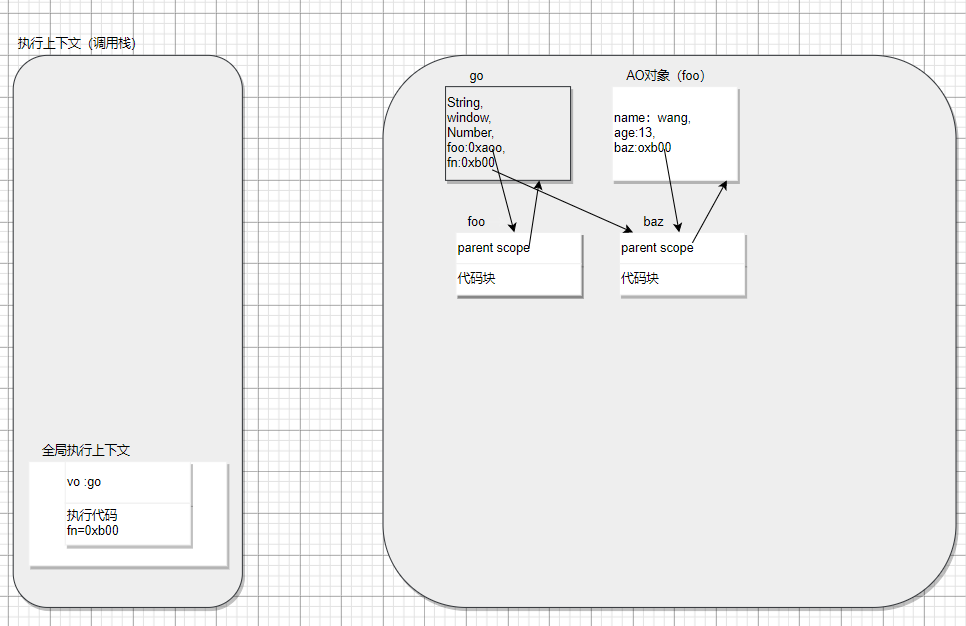
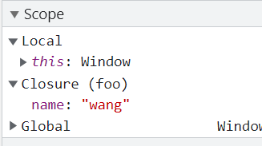

#  函数和闭包

### 函数是一等公民

函数是一等公民，意思是函数是非常重要的。

函数可以做为另一个函数的参数，也可以做为另一个函数的返回值来返回。

js中函数中仍然可以定义函数，实现函数嵌套。

### 函数属性

#### name

函数对外暴露一个只读的函数名【name】属性。

```js
function foo() {}
let sum = function () {};
let add = () => {};
console.log(foo.name); //foo
console.log(sum.name); //sum
console.log(add.name); //add
console.log(function () {}.name); //空字符串
console.log(new Function().name); //anonymous

//获取函数，设置函数，bind() name中会有一个前缀
console.log(foo.bind().name); //bound foo

let obj = {
    _name: "feaw",

    get name() {
        return this._name;
    },
    set name(value) {
        this._name = value;
    },
};
let des = Object.getOwnPropertyDescriptor(obj, "name");
console.log(des.get.name); // set name
console.log(des.set.name); // get name

```

#### caller

调用当前函数的函数。全选作用域下调用函数，caller为null。（箭头函数没有该属性）

```js
function baz() {
	foo();	
}
function foo() {
	console.log(arguments.callee.caller);//baz函数
}
baz();
```

### arguments

arguemnt是一个类数组。

特点：

1. 有length属性
2. 可以通过index来遍历
3. 可以通过index索引来获取值
4. arguments.callee获取当前函数，在严格模式下是不能使用的。

将类数组转为数组：

```js
function foo() {
  console.log(arguments);
  //1.遍历转化
  let arr = [];
  for (const item of arguments) {
    arr.push(item);
  }
  console.log(arr);
  //2.slice方式
  const arr2 = Array.prototype.slice.call(arguments);
  const arr5 = [].slice().call(arg)
  console.log(arr2);
  //3.es6以后
  const arr3 = [...arguments];
  const arr4 = Array.from(arguments);
  console.log(arr3, arr4);
}
```

slice方法：slice(start,end)是数组的一个内置方法，遍历数组，返回新的数组。

slice()函数的内部实现：

```js
Array.prototype.lzslice = function (start, end) {
  const args = this;
  start = start || 0;
  end = end || this.length;
  let arr = [];
  for (let i = start; i < end; i++) {
    arr.push(args[i]);
  }
  return arr;
};
```

递归: 由于我们可能要函数内部调用函数自身，为了与函数名解耦，我们可以使用arguments.callee( )来调用自身，但是在严格模式下不能使用该属性。

因此，我们可以将命名函数赋值为一个变量，改写成表达式的形式。foo只能在函数内部使用，再外部使用会报错。

```JS
"use strict";
let f = function foo(n) {
    if (n > 4) return;
    console.log("23");
    foo(++n);//引用自身
};
let baz = f;
baz(1);
```

#### 命名参数和arguments的关系

命名参数和arguments的值是会保持同步的。修改arguments的值或命名参数的值，他们的值都会发生改变。

另一种情况：如果只传入了一个值，修改arguments[1]的值，此时b的不会改变，依然是undefined。这是因为arguments的长度是根据传入的参数个数来决定的，而非定义时给出的命名参数个数确定的。

严格模式：修改arguments或命名参数后，值不会同步修改。

```js
function foo(a, b) {
    console.log(arguments);//[12,55]
    console.log(a, b);//12,55
    arguments[1] = 11;
    // b = 11;
    console.log(arguments);//[12,11]
    console.log(a, b);//12 ,11
}

foo(12, 55);
```

### 闭包

闭包 : 指的是那些引用了另一个函数作用域中变量的函数。

严格来说就是函数内部访问了外部的自由变量，这就是一个闭包。

### 代码执行过程

```js
  //闭包
        function foo() {
            var name = 'wang';
            var age = 13;

            function baz() {
                console.log(name);
                console.log(age);
            }
            return baz;
        }

        var fn = foo();
        fn();
```

###### 1.在堆中创建go对象, 并且创建了执行上下文栈


###### 2.在执行上下文栈中创建了全局执行上下文

全局执行上下文中先预解析代码，foo为函数，foo会保存foo函数的地址，fn为变量，初始值为undefined



###### 3.开始执行foo函数前先解析foo函数

预解析是会创建AO(foo)对象，保存foo函数中的变量，由于baz是函数，会创建baz函数对象。

![image-20210919123710775]3.png)

###### 真的的执行foo函数

创建函数执行上下文（foo）,执行代码后，name:wang , age:13 ,return baz 最终全局执行上下文接受到foo的返回值并赋给了fn,因此fn保存了baz函数对象的地址



###### foo函数执行完毕

foo执行完毕以后，相应的函数执行上下文会被销毁，正常情况下foo的AO对象也应该销毁，但此时baz函数的父级作用域指向的是foo的AO对象，所以不会被销毁。



###### 执行fn函数

执行fn函数实际上是执行baz函数。首先，同样是先解析baz内部代码，创建baz的AO对象，因为没有定义变量，所以baz的AO对象为空，然后直接执行代码，打印name和age。因为当前AO对象中没有name和age属性，所以会从他的父级AO对象中查找name和age，查找都父级AO(foo)对象的name和age后，打印出来。



###### 执行完fn函数

执行完fn函数以后，创建的函数执行上下文和AO对象都会被销毁。但foo的AO对象，因为一直有baz函数的parent scope 指向他，所以一直不会被释放。所以可能会出现内存泄漏，当我们不再使用它的时候可以通过 fn=null 来释放闭包，放置内存泄漏.



### AO中不使用的变量

闭包可以访问外层AO的变量，使得外层AO不会被销毁，但是外层AO中不使用的变量，按道理应该不被销毁，因为整个AO都不会被销毁，但v8引擎做了优化，不使用的变量会被销毁，防止了内存泄漏。

```js
function foo() {
    var name = 'wang';
    var age = 12;

    function baz() {
        debugger //设置断点
        console.log(name);
    }
    return baz;
}

var fn = foo();
fn();
```



可以看出闭包Closure中只剩下name变量。
