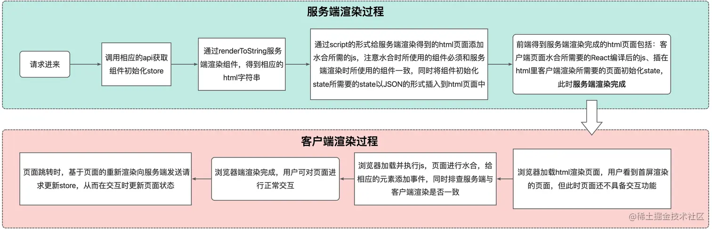
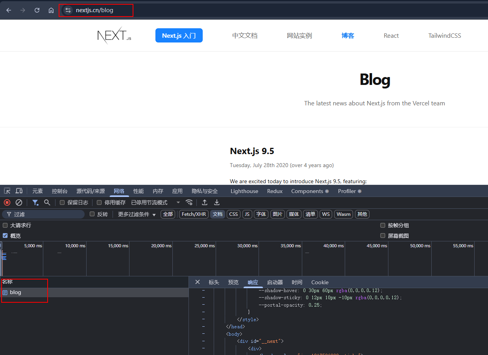

# nextJs渲染原理

渲染流程：

1. 接口请求
2. 服务端请求数据，依据请求到的数据渲染出html,返回给浏览器生成的html文件和js文件
3. 浏览器加载html,渲染页面。此时页面还不能交互
4. 浏览器执行js文件和获取数据，页面进行水合（水合就是客户端请求到的数据来生成DOM,并且和服务端生成的DOM进行对比，更新不一致的内容），给页面元素添加事件。
5. 浏览器渲染完成，可交互。
6. 页面跳转时，想服务器请求新页面的state，使用spa单页面的特性更新页面内容。（浏览器会返回一个json文件，里面包含将要渲染的内容）

渲染过程经历了：
1. 服务端注入状态 - 注水
2. 生成了静态的html,传递给客户端 - 抽水
3. 客户端请求数据，注入动态数据，更新服务端生成的DOM结构 - 注水 

如下图，点击link时，浏览器请求了getting-started.json文件

刷页面时，回去请求当前页面的html资源，而不是去更新原有页面内容。

