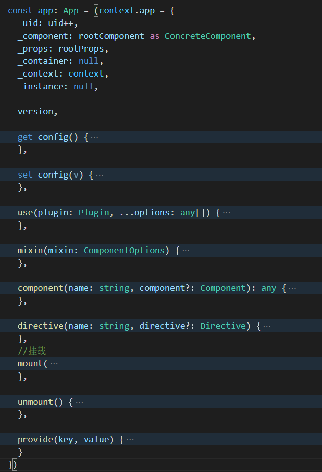
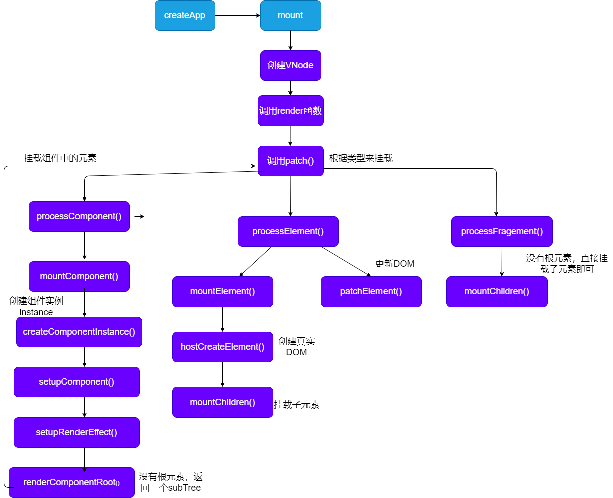
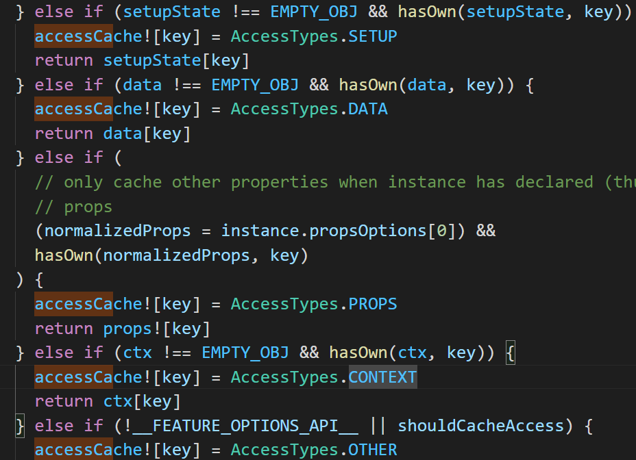
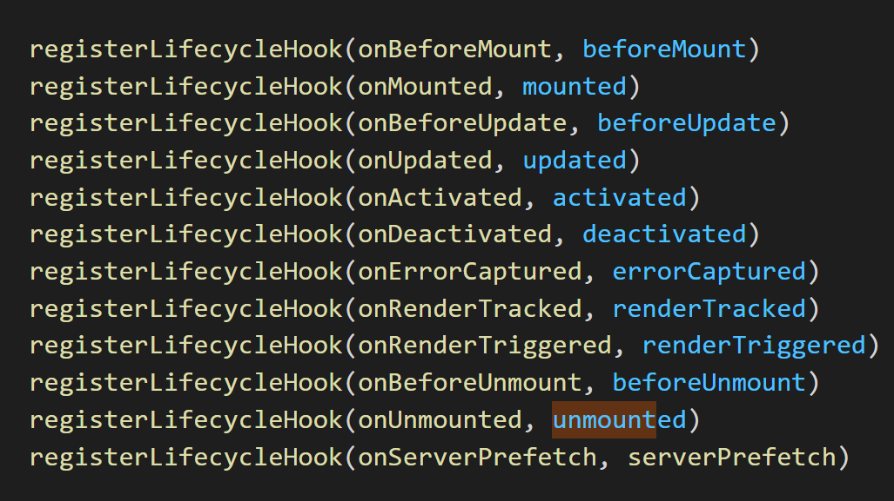
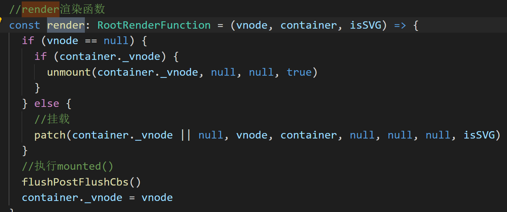

# vue3创建组件的过程探究

vue3中，我们执行createApp到底发生了什么呢，接下来，我们来一步一步的捋一下。

创建vue实例时，我们经常使用createApp()，然后通过ceateApp函数返回的app对象，来使用mount()来挂载我们的组件。接下来，我们来看一下createApp()和mount()在源码中的执行流程。

### createApp

我们使用createApp()，使用的是vue源码中runtime-dom/src/index.ts文件导出的createApp函数。


1. 调用runtime-dom/src/index.ts中导出的createApp函数。

2. createApp()中调用ensureRenderer( )

3. ensureRenderer( )中调用createRenderer( )

4. createRenderer( )中调用baseCreateRenderer（），baseCreateRenderer返回\{hydrate\,  createApp: createAppAPI(render, hydrate)}

5.  最后实际上我们调用的是createAppAPI( )中返回的createApp函数。

6. 最后执行完createApp以后，返回app对象，app对象中包含mount，use，mixin，component，directive，provide等全局api方法。 createApp函数中为我们返回一个App对象。该对象中包含了我们要使用的全局方法。




### 执行mount

1. 执行createApp中的mount()函数
1. mount()中先创建VNode,然后再调用render()函数
2. mount中调用baseCreateRenderer返回值中的render()渲染函数。
3. 如果新创建vnode不为null，则执行patch()，挂载vnode.
4. patch()中会进行类型判断，在这里我们是一个组件，因此执行processComponent
   1. 是组件则执行processComponent。
   2. 是元素则执行processElement
   3. 是fragement则执行processFragment
5. 执行processComponent中的mountComponent()
6. **mountComponent()**中先执行createComponentInstance()，创建组件实例，然后执行setupComponent()，初始化组件实例。
7. 调用设置和渲染有副作用的函数，setupRenderEffect()
8. 执行renderComponentRoot（），如果没有根元素，则获取到subTree。（subTree是用Fragement包裹的所有元素）
9. 执行patch函数
10. 有根元素，则执行processElement().
11. 如果有n1(旧vnode)为null，则执行mountElement,否则执行patchElement.
12. mountElement中根据vnode,通过hostCreateElement()创建真实的element.
13. 如果有子元素，则通过mountChildren()挂载子元素，遍历所有的子元素进行挂载。
14. 最后通过hostInsert()，将el挂载到container中。

挂载流程：

​	

### setupComponent初始化实例

1. 处理props和attrs
2. 处理slots
3. 执行setup()
4. 经过complie()编译tempalte，将template模板转为render函数。
5. 调用applyOptions()对vue2中options API 进行处理。

### complie

经过complie后，我们的template模板会被编译为render函数；

_createElementVNode()相当于h()函数。

在vue中数据的更新是组件级别的，

```js
//模板
<template id="app">
      <span>你好啊</span>
      <div>静态的元素</div>
      <div>{{count}}</div>
      <button @click="fn">+1</button>
</template>


//转为的render函数
(function anonymous(
) {
const _Vue = Vue
const { createElementVNode: _createElementVNode } = _Vue


/* 作用域提升
由于组件的挂载和更新都是要执行render函数的，又因为_hoisted_1,_hoisted_2中都没有引用动态的变量，是不会改变的，因此不用每次执行render函数都再次创建静态的vnode，所以这里做了作用的提升，不用每次都执行，提高了性能。
*/


const _hoisted_1 = /*#__PURE__*/_createElementVNode("span", null, "你好啊", -1 /* HOISTED */)
const _hoisted_2 = /*#__PURE__*/_createElementVNode("div", null, "静态的元素", -1 /* HOISTED */)
const _hoisted_3 = ["onClick"]

//生成的render函数
return function render(_ctx, _cache) {
  with (_ctx) {
    const { createElementVNode: _createElementVNode, toDisplayString: _toDisplayString, Fragment: _Fragment, openBlock: _openBlock, createElementBlock: _createElementBlock } = _Vue
	
    
/* blockTree 
	由于patch和diff算法中，我们不需要diff静态结点，因此这里我们可以将动态的节点，添加到一个数组中，我们只diff这个数组中即可。
	openBlock()方法就是创建了一个数组，用于保存动态的节点。
	当我们更新组件时，我如果我们有blockTree，那么它将仅仅patch block即可。这样我们需要对比的vnode会减少，因此可以提高性能。如果没有blockTree，它将直接patch children，这样性能肯定是比较差的。
 	
*/
    return (_openBlock(), _createElementBlock(_Fragment, null, [
        //四个vnode，前两个做了提升，后面两个没有提升
      _hoisted_1,
      _hoisted_2,
      _createElementVNode("div", null, _toDisplayString(count), 1 /* TEXT */),
      _createElementVNode("button", { onClick: fn }, "+1", 8 /* PROPS */, _hoisted_3)
    ], 64 /* STABLE_FRAGMENT */))
  }
}
})
```

### template中数据的使用顺序



由图可知：当我们存在变量名冲突时，使用顺序为：

1. setup()
2. data
3. props
4. ctx中的methods或computed

### 组件的VNode和组件的instance

- VNode是组成虚拟DOM树
- 组件实例上保存了我们使用的状态和方法。

### 声明周期钩子

调用applyOptions()，初始化实例对象，该函数一开始就回调beforeCreated();

初始化完成后回调created()函数。

其他声明周期会先注册



其他的生命周期函数都是在setupRenderEffect()函数中调用的。

并且由于mounted(),updated(),unmounted()这几个生命周期函数不是立即执行的，不能明确什么时候执行完毕，因此通过queuePostRenderEffect()函数将他们放入了一个队列当中，当执行完以后再通过render()中的flushPostFlushCbs()来回调相应的生命周期函数。

