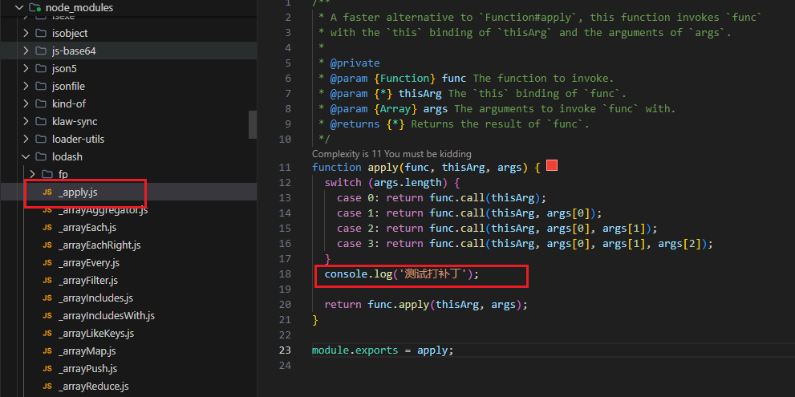
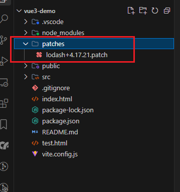

# npm 包打补丁

当使用一个npm包时，发现了存在bug,并且新版本也没有解决时。我们就要自己修复该bug，给整个npm包打补丁来修复它。

## 安装patch-package

`npm install patch-package`

## 修复npm包中存在的问题

这里我们那lodash这个库来测试，添加一行代码。



## 执行命令打补丁

`npx patch-package lodash`

注意：pnpm不支持patch-package打补丁，因为无法识别pnpm的lock文件。

执行命令后，生成了patches文件，并且可以看到一个lodash的补丁文件。




lodash+4.17.21.patch 补丁内容如下：

```path 
diff --git a/node_modules/lodash/_apply.js b/node_modules/lodash/_apply.js
index 36436dd..041fd30 100644
--- a/node_modules/lodash/_apply.js
+++ b/node_modules/lodash/_apply.js
@@ -15,6 +15,8 @@ function apply(func, thisArg, args) {
     case 2: return func.call(thisArg, args[0], args[1]);
     case 3: return func.call(thisArg, args[0], args[1], args[2]);
   }
+  console.log('测试打补丁');
+  
   return func.apply(thisArg, args);
 }
```

## 添加postinstall脚本命令

最后，为了保证其他人拉取代码后也执行补丁文件，我们需要再scripts中加一个自动加载补丁的脚本。

``` json
  "scripts": {
    "dev": "vite",
    "build": "vite build",
    "preview": "vite preview",
    "postinstall": "patch-package"
  },
```

