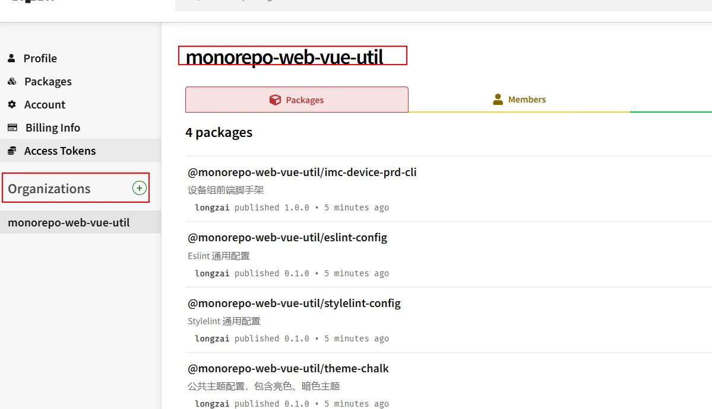

# pnpm + monorepo + changeset实现多包管理和发布

## npm 发包网络超时问题：
1. 打开vpn
2. 配置npm 代理 npm config set proxy http://127.0.0.1:7890

## 发布monerepo包
发布monerepo包需要在npm上创建Organizations

使用changeset 工具发包
1. pnpm install @changesets/cli -w --save-dev 下载工具
2. pnpm changeset init 初始化