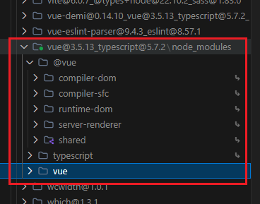

# pnpm中的软链接和硬链接

pnpm 通过**软链接**和**硬链接**的结合使用，解决了传统包管理工具（如 npm、Yarn）的存储冗余和依赖管理问题，同时提升了安装效率和安全性。以下是其核心机制和实现原理：

---

### 一、硬链接（Hard Link）
#### 1. **定义与特性**
硬链接是文件系统中多个文件名指向同一 inode（文件元数据）的机制。其特点包括：
- **共享存储**：所有硬链接指向同一物理文件，修改任一链接会影响所有关联文件。
- **删除不影响实体**：仅当所有硬链接被删除后，文件实体才会从磁盘移除。
- **节省空间**：无论创建多少硬链接，磁盘仅存储一份文件副本。

#### 2. **pnpm 中的应用**
pnpm 将所有依赖包统一存储在**全局仓库**（默认路径如 `~/.pnpm-store`），通过硬链接将相同版本包的文件指向全局仓库的同一 inode。例如：
- 项目 A 和项目 B 均安装 `express@4.17.1`，它们的 `node_modules` 中 `express` 文件实际是全局仓库的硬链接。
- 文件 inode 号和硬链接数量会随复用次数增加，显著减少磁盘占用。

---

### 二、软链接（Symbolic Link）
#### 1. **定义与特性**
软链接是类似快捷方式的指针，存储目标文件的路径而非直接引用 inode。其特点包括：
- **路径指向**：若源文件被删除，软链接会失效（显示为“白字红底闪烁”）。
- **灵活性**：可跨文件系统或目录层级创建。

#### 2. **pnpm 中的应用**
pnpm 通过软链接构建**非扁平化的 `node_modules` 结构**，解决“幽灵依赖”问题：
- **直接依赖**：项目 `package.json` 中声明的包，以软链接形式出现在顶层 `node_modules`，指向 `.pnpm/[package]@version/node_modules/[package]`。
- **间接依赖**：嵌套在 `.pnpm` 目录中，仅通过软链接被直接依赖引用，避免被项目代码误引用。
- **目录结构清晰**：仅声明过的依赖可见，兼容 Node.js 模块解析规则的同时，确保依赖树透明可控。

如Vue包，会在`Vue@版本`目录下的`node_modules`中存在Vue库和他的依赖


---

### 三、软硬链接的协同作用
1. **存储优化**：硬链接复用全局仓库文件，避免重复下载。
2. **依赖隔离**：软链接实现依赖层级隔离，防止非法访问未声明的包。
3. **性能提升**：安装时仅需创建链接，无需复制文件，速度显著快于传统工具。

---

### 四、实际使用中的注意事项
1. **路径敏感性问题**：某些工具或脚本依赖绝对路径或传统扁平化结构，可能导致兼容性问题。可通过配置 `.npmrc` 添加 `shamefully-hoist=true` 临时提升依赖层级。
2. **全局仓库管理**：默认存储位置可能在系统盘，可通过命令调整：
   ```bash
   pnpm config set store-dir /自定义路径
   ```
3. **镜像源配置**：与 npm 类似，可切换镜像加速下载：
   ```bash
   pnpm config set registry https://registry.npmmirror.com
   ```

---

### 五、与传统工具的对比
| 特性                | npm/Yarn              | pnpm                  |
|---------------------|-----------------------|-----------------------|
| **存储方式**        | 多副本冗余存储        | 硬链接复用全局文件    |
| `node_modules` 结构 | 扁平化（易产生幽灵依赖）| 嵌套软链接隔离依赖    |
| **安装速度**        | 较慢                  | 快 2 倍以上[4](@ref)     |
| **磁盘占用**        | 高                    | 低（依赖版本一致时）  |

---


### 总结
pnpm 的软硬链接机制通过**全局硬链接存储**和**项目级软链接引用**，实现了高效、安全的依赖管理。这种设计不仅解决了传统工具的存储冗余问题，还通过严格的依赖隔离提升了项目的健壮性，尤其适合大型项目或 Monorepo 场景[1](@ref)[4](@ref)。