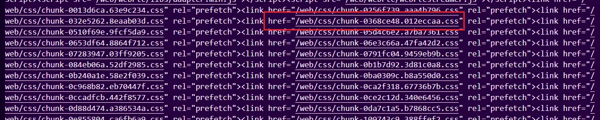
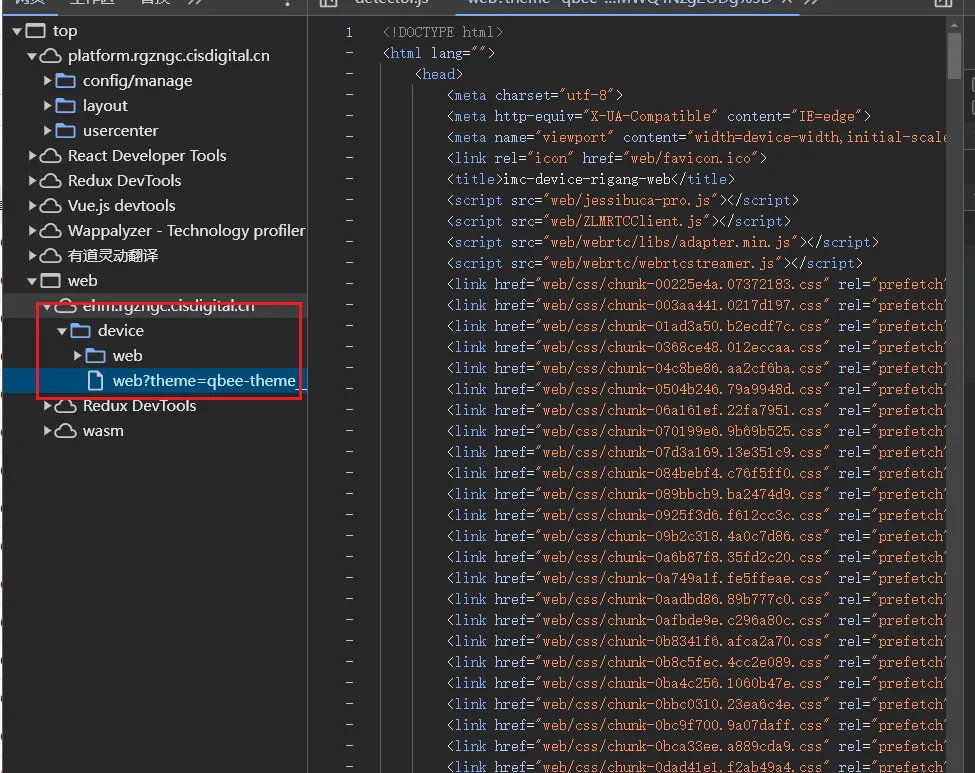
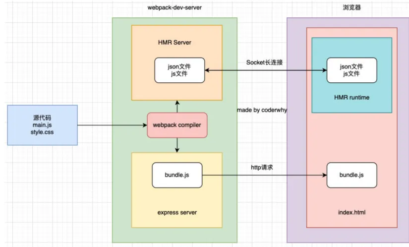

# webpack基础

> **webpack** 是一个用于现代 JavaScript 应用程序的 _静态模块打包工具_。当 webpack 处理应用程序时，它会在内部从一个或多个入口点构建一个 [依赖图(dependency graph)](https://webpack.docschina.org/concepts/dependency-graph/)，然后将你项目中所需的每一个模块组合成一个或多个 _bundles_，它们均为静态资源，用于展示你的内容。
>

### 安装

我们可以在命令行直接全局安装webpack，webpack-cli。

命令

```plain
npm install webpack webpack-cli –g
```

然后在我们想要打包的项目文件下，执行webpack命令，即可对src/index.js的文件作为入口，进行打包。

<font style="color:#E8323C;">注意：</font>所有打包的文件，都需要从index.js入口文件，寻找到依赖的文件，如果文件没有被导入引用，那么该文件不会被打包。

由于当多个项目使用全局webpack时，可能出现版本不统一，导致兼容性问题。因此我们一般在项目中会使用局部的webpack。

项目中安装webpack:

```plain
npm install webpack webpack-cli –D
```

### 项目中使用局部webpack
默认情况下，我们在终端执行webpack时，默认使用的全局的webpack。  
使用局部webpack，可以有两种方式：

1. 通过路径执行局部的webpack
2. 在package.json中通过scriptes配置执行webpack命令。如果局部安装就是用局部的webpack,否则使用全局的。

### 配置webpack

webpack的默认配置是不能满足我们复杂的项目的，因此webpack允许我们在项目的根目录下建一个webpack.config.js文件，用于配置webpack。

```javascript
const path = require("path");

module.exports = {
   //入口文件
  entry: "./src/index.js",
    //打包后的导出文件
  output: {
    filename: "bundle.js",
    path: path.resolve(__dirname, "./dist"),
  },
};
```

我们也可以修改配置文件名，此时，我们就需要在package.json文件中配置运行命令，来识别自定义的配置文件名。


如果我们webpack配置文件名为wk.js，那么我们需要在package.json中进行如下配置。

```json
  "scripts": {
    "build": "webpack --config wk.js"
  },
```

### 入口和上下文
`context:`<font style="color:rgb(43, 58, 66);">基础目录，</font>**<font style="color:rgb(43, 58, 66);">绝对路径</font>**<font style="color:rgb(43, 58, 66);">，用于从配置中解析入口点(entry point)和 加载器(loader)。</font>

<font style="color:rgb(43, 58, 66);">默认值是该项目的根目录。</font>

```json
//环境上下文就是该配置文件的当前文件夹
context:path.resolve(__dirname,'./'),
// 入口文件 
entry: './src/index.js',
```

## mode

用于设置是开发模式还是生产模式。默认情况是生产模式。

| 选项 | 描述 |
| :--- | :--- |
| `development` | 会将 `DefinePlugin`<br/> 中 `process.env.NODE_ENV`<br/> 的值设置为 `development`<br/>. 为模块和 chunk 启用有效的名。 |
| `production` | 会将 `DefinePlugin`<br/> 中 `process.env.NODE_ENV`<br/> 的值设置为 `production`<br/>。为模块和 chunk 启用确定性的混淆名称，`FlagDependencyUsagePlugin`<br/>，`FlagIncludedChunksPlugin`<br/>，`ModuleConcatenationPlugin`<br/>，`NoEmitOnErrorsPlugin`<br/> 和 `TerserPlugin`<br/> 。 |
| `none` | 不使用任何默认优化选项 |

配置：

```plain
module.exports={
	mode:'development'
}
```

开发模式：（development）可以帮助我们寻找错误，定位到出错的文件。

生产模式：（production） 代码会被压缩和丑化等一系列操作，我们是无法阅读的，出错后没有办法定位错误。

## devtool


此选项控制是否生成，以及如何生成 source map。


如果为开发模式，默认使用的是eval选项。 


常用值：


`source-map：` 整个 source map 作为一个单独的文件生成。它为 bundle 添加了一个引用注释，以便开发工具知道在哪里可以找到它。


`eval` ：每个模块都使用 `eval()` 执行，并且都有 `//@ sourceURL`。此选项会非常快地构建。主要缺点是，由于会映射到转换后的代码，而不是映射到原始代码（没有从 loader 中获取 source map），所以不能正确的显示行数。

`cheap-source-map` 没有列映射(column mapping)的 source map，忽略 `loader source map`。

`cheap-module-source-map`没有列映射(column mapping)的 source map，将 `loader source map` 简化为每行一个映射(mapping)

配置：

```plain
module.exports={
	devtool:'source-map'
}
```

**<font style="color:rgb(89,89,89);">那么在开发中，最佳的实践是什么呢？ </font>**

<font style="color:rgb(255,0,0);">开发阶段：</font><font style="color:rgb(89,89,89);">推荐使用 source-map或者cheap-module-source-map </font>

<font style="color:rgb(89,89,89);"> 这分别是vue和react使用的值，可以获取调试信息，方便快速开发； </font>

<br/>

<font style="color:rgb(255,0,0);"> 测试阶段：</font><font style="color:rgb(89,89,89);">推荐使用 source-map或者cheap-module-source-map </font>

<font style="color:rgb(89,89,89);"> 测试阶段我们也希望在浏览器下看到正确的错误提示； </font>

<br/>

<font style="color:rgb(255,0,0);">发布阶段：</font><font style="color:rgb(89,89,89);">false、缺省值（不写）</font>


## output

### publicPath
publicPath用来配置打包后，index.html引用其他资源的基本路径。

默认值：空字符,打包后就是bundle.js 。 <font style="color:#FA8C16;">在server和本地运行都是可以的。</font>

`'/'` :  打包后是/bundle.js,通常在生产环境下设置这个值。(本地运行会出错，找不到资源文件)

`'./'`:打包后是./bundle.js ，可以依据index.html的位置来寻找到资源文件。


在 Vue CLI 中，publicPath 的默认值是根路径 '/'，这意味着打包后的资源将被放置在服务器的根目录下。如果你设置了 `publicPath: './'`，则资源将与 index.html 保持在同一目录下。但是，publicPath 设置为 `./web` 并不会在 dist 目录中创建一个 web 文件夹，而是告诉 Webpack 在构建时生成的资源URL前加上 `./web` 前缀。

案例:

```javascript
publicPath: ['production', 'test'].includes(process.env.NODE_ENV)
    ? '/web'
    : './',
```

在配置了/web后，index.html文件引用资源的路径前都加了一个/web



部署在服务器时，我们的那文件路径是这样的



### 打包库

配置文件：

```javascript
const path = require("path");

module.exports = {
  mode:'production',
   //入口文件
  entry: "./index.js",
    //打包后的导出文件
  output: {
    filename: "bundle.js",
    path: path.resolve(__dirname, "./dist"),
    libraryTarget:'umd', //兼容不同导入方式
    library:'longzai', //导入时的库名
    globalObject:'this' // 全局对象的指向
  },
  
};
```

## 搭建本地服务

之前我们都是通过webpack来对项目进行打包，然后利用vscode的live server插件，来运行我们的项目的。那么会带了一个问题，每次更新代码都要重新打包代码，为了解决这个问题，我们可以使用一下两种方法。

一、webpack watch mode；

二、webpack-dev-server（常用）

### webpack watch mode

我们可以通过配置wepback为watch模式，在该模式下，webpack依赖图中的所有文件，只要有一个发生了更新，那么代码将被重新编译； 这要我们就不需要手动进行打包了。

配置方式：

在启动webpack的命令中，添加 --watch的标识；

```json
"scripts": {
    "build": "webpack --watch"
  },
```

1.  效率比较低，只要有部分文件发生变化，所有的文件都会重新被打包。 
2.  编译成功后会生成新的文件。 
3.  会刷新整个页面。 
4.  需要借助使用live-server。 

### webpack-dev-server

安装：

```plain
npm install webpack-dev-server -D
```
配置script脚本：

```json
  "scripts": {
    "build": "webpack",
    "serve": "webpack serve",
  },
```
配置devServer:

1. static：配置从相应目录提供静态文件，默认为public文件夹

案例：

```js
devServer: {
  hot: true,
  static:{
    //设置assets文件夹提供静态资源
    directory: path.join(__dirname, "assets")
  }
},
```

那么在index.html中可以通过这样直接来获取assets文件夹下的one.js文件。

`<scriptsrc="./one.js"></script>`


2. hot：配置模块热替换（Hot Module Replacement）,模块热替换是指在 应用程序运行过程中，替换、添加、删除模块，而无需重新刷新整个页面；

```javascript
devServer: {
    static: {
      directory: path.join(__dirname, "assets"),
    },
    hot: true, //启用模块热替换
    host: "localhost", //设置host
    port: 8005, //设置端口号
    open: true, //自动打开浏览器
    compress: true, //将静态资源进行gzip压缩
  },
```

配置了hot为true后，我们还需要指定哪些模块需要模块热替换。

```javascript
import "./js/component";
if (module.hot) {
  module.hot.accept("./js/component.js", function () {});
}
```

像上面这样配置，一个一个配置需要模块热替换的模块，很麻烦，但是不必担心，在vue和react中都有成熟的库为我们解决这个问题。

#### vue模块热替换
加载.vue文件，使用vue-loader来加载vue文件，即可实现模块热替换。

vue-loader加载的组件默认会帮助我们进行HMR的处理。

#### React模块热替换
使用react-refresh实现react的模块热替换。

安装插件和react-refresh

`npm install -D @pmmmwh/react-refresh-webpack-plugin react-refresh `

webpack.config.js中配置插件：

```json
const ReactRefreshWebpackPlugin = require('@pmmmwh/react-refresh-webpack-plugin');
plugins: [
    new ReactRefreshWebpackPlugin(),
  ]
```

  
 babel.config.json中配置插件：

```json
"plugins": [ ["react-refresh/babel"]]
```

#### HMR的原理


>  HMR Socket Server，是一个socket的长连接： 
>
> 1.长连接有一个最好的好处是建立连接后双方可以通信（服务器可以直接发送文件到客户端）； 
>
> 2.当服务器监听到对应的模块发生变化时，会生成两个文件.json（manifest文件）和.js文件（update chunk）；
> 
> [hash].hot-update.json（manifest 文件）：
> 包含更新的模块信息，如模块 ID 和更新的 chunk 名称。
>
> [hash].hot-update.js（update chunk）：
> 包含更新后的模块代码。 
>
>
>
> 3.通过长连接，可以直接将这两个文件主动发送给客户端（浏览器）； 
>
> 4.浏览器拿到两个新的文件后，通过HMR runtime机制，加载这两个文件，并且针对修改的模块进行更新；
>


### proxy
配置代理服务器来解决跨域问题。

target：表示的是代理到的目标地址，比如 /api/moment会被代理到 http://localhost:8888/api/moment； 

pathRewrite：默认情况下，我们的 /api-hy 也会被写入到URL中，如果希望删除，可以使用pathRewrite； 

secure：默认情况下不接收转发到https的服务器上，如果希望支持，可以设置为false； 

changeOrigin：它表示是否更新代理后请求的headers中host地址；默认值为false，不改变源地址。

例如：代理服务器是http:localhost:3000,目标服务器是：http://localhost:8000,

默认是：http:localhost:3000 ，设置changeOrigin后，host地址就变为了http:localhost:8000（有种欺骗服务器的感觉）

historyApiFallback<font style="color:rgb(169, 190, 204);">:</font> <font style="color:rgb(83, 183, 230);">默认为false, 设置为true时，可以解决点页面应用刷新404的问题</font>

```json
 devServer: {
    proxy: {
      '/api': {
        target: 'https://other-server.example.com',
        secure: false,
      },
    },
  },
```

### resolve
resolve用于设置模块如何被解析：


+ 在开发中我们会有各种各样的模块依赖，这些模块可能来自于自己编写的代码，也可能来自第三方库；
+ resolve可以帮助webpack从每个 require/import 语句中，找到需要引入到合适的模块代码；
+ webpack 使用 enhanced-resolve 来解析文件路径；


**webpack能解析三种文件路径：**


绝对路径 :


+ 由于已经获得文件的绝对路径，因此不需要再做进一步解析。


相对路径 :


+ 在这种情况下，使用 import 或 require 的资源文件所处的目录，被认为是上下文目录；
+ 在 import/require 中给定的相对路径，会拼接此上下文路径，来生成模块的绝对路径；


模块路径


+ 在 resolve.modules中指定的所有目录检索模块；
+ 默认值是 ['node_modules']，所以默认会从node_modules中查找文件；


##### 确定是文件还是文件夹


如果是文件：


1. 有后缀名，则加载该文件
2. 没有后缀名，使用resolve.extensions选项作为文件扩展名解析；extensions默认值为 ['.wasm', '.mjs', '.js', '.json']；


如果是文件夹：会在文件夹中根据 resolve.mainFiles配置选项中指定的文件顺序查找；


+ resolve.mainFiles的默认值是 ['index']；
+ 再根据 resolve.extensions来解析扩展名；


配置resolve:


```javascript
 resolve: {
    extensions: [".wasm", ".mjs", ".js", ".json", ".vue"],//扩展名
    alias: {
      "@": path.resolve(__dirname, "./src/js"),//起别名
    },
  },
```


### 区分开发和生产环境


配置不同的webpack配置文件。然后开发和生产时使用不同的配置文件。


注意:


1. entry的路径相对于context,context默认为项目根目录。


自定义执行命令，使用config文件下的配置文件。

```json
"scripts": {
  "build": "webpack --config ./config/webpack.com.config.js --env=production ",
  "serve": "webpack serve  --config ./config/webpack.com.config.js --env=development ",
  "type-check": "tsc --noEmit --watch"
},
```


和并配置配置文件时，使用到了`webpack-merge`


在项目根目录创建config文件夹，进行环境配置的分离。

公用配置文件：webpack.com.config.js

```javascript
const path = require('path');
const HtmlWebpackPlugin = require('html-webpack-plugin');
const { DefinePlugin } = require('webpack');
const { VueLoaderPlugin } = require('vue-loader/dist/index');
const MiniCssExtractPlugin = require('mini-css-extract-plugin');
const Dotenv = require('dotenv-webpack');
const { merge } = require("webpack-merge");

const proconfig = require('./webpack.pro.config');
const devconfig = require('./webpack.dev.config');
const config = {
    //环境上下文就是该配置文件的当前文件夹
    // context: path.resolve(__dirname, '../'),
    // 入口文件 
    entry: './src/index.js',
    // 打包后的导出文件
    output: {
        filename: '[name].bundle.js',
        path: path.resolve(__dirname, '../dist'),
        chunkFilename: 'chunk_[id]_[name].js',
    },
    module: {
        rules: [{
                test: /\.js$/,
                exclude: /node_modules/,
                use: [
                    'babel-loader',
                ],
            },
            {
                test: /\.ts$/,
                exclude: /node_modules/,
                use: [{
                    loader: 'babel-loader',
                }, ],
            },
            {
                test: /\.vue$/,
                exclude: /node_modules/,
                use: [{
                    loader: 'vue-loader',
                }, ],
            },
        ],
    },
    plugins: [
        new Dotenv(),
        new VueLoaderPlugin(),
        new HtmlWebpackPlugin({
            // 模板文件
            template: './public/index.html',
            // 模板中使用到的title属性
            title: 'webpack项目',
        }),
        new DefinePlugin({
            // 设置全局变量
            BASE_URL: "'./'",
            __VUE_OPTIONS_API__: true,
            __VUE_PROD_DEVTOOLS__: false,
        }),
        //css文件分包
        new MiniCssExtractPlugin({
            filename: 'css/[name][contenthash:8].css',
            chunkFilename: 'css/[name][contenthash:8].css'
        })
    ],
};

module.exports = (env) => {
    curConfig = env.production ? proconfig : devconfig;
    return merge(config, curConfig)
}
```


开发环境配置文件：webpack.dev.config.js


```javascript
const comConfig = require("./webpack.com.config");
const path = require("path");
module.exports = {
    mode: "development",
    devtool: "source-map",
    devServer: {
        static: {
            directory: path.join(__dirname, "assets"),
        },
        hot: true, //启用模块热替换
        host: "localhost", //设置host
        port: 8005, //设置端口号
        open: true, //自动打开浏览器
        compress: true, //将静态资源进行gzip压缩
    },
    module: {
        rules: [{
            test: /\.css$/, // 匹配.css文件,
            exclude: /node_modules/,
            use: [
                'style-loader',
                {
                    loader: 'css-loader',
                    options: {
                        importLoaders: 1,
                        // 0 => no loaders (default);
                        // 1 => postcss-loader;
                        // 2 => postcss-loader, sass-loader
                    },
                },
                {
                    loader: 'postcss-loader',
                    options: {
                        postcssOptions: {
                            plugins: [require('postcss-preset-env')],

                        },
                    },
                },
            ], // 使用css-loader,style-loader
        }, ]
    }
}
```


生产环境配置文件：webpack.pro.config.js


```javascript
const CopyWebpackPlugin = require("copy-webpack-plugin");
const { CleanWebpackPlugin } = require("clean-webpack-plugin");
const MiniCssExtractPlugin = require('mini-css-extract-plugin');

module.exports = {
    mode: "production",
    externals: {
        lodash: '_',
        dayjs: 'dayjs'
    },
    module: {
        rules: [{
            test: /\.css$/, // 匹配.css文件,
            exclude: /node_modules/,
            use: [
                MiniCssExtractPlugin.loader,
                {
                    loader: 'css-loader',
                    options: {
                        importLoaders: 1,
                        // 0 => no loaders (default);
                        // 1 => postcss-loader;
                        // 2 => postcss-loader, sass-loader
                    },
                },
                {
                    loader: 'postcss-loader',
                    options: {
                        postcssOptions: {
                            plugins: [require('postcss-preset-env')],

                        },
                    },
                },
            ], // 使用css-loader,style-loader
        }, ]
    },
    optimization: {
        chunkIds: 'named', // 
        splitChunks: {
            // include all types of chunks
            chunks: 'all',
            minSize: 200,
            maxSize: 200,
            cacheGroups: {
                Vendors: {
                    test: /[\\/]node_modules[\\/]/,
                    priority: -10, //优先级
                    filename: '[id]_vendors.js'
                },
                default: {
                    minChunks: 1,
                    priority: -20,
                    filename: 'common_[name].js'
                },
            },
        },
        minimize: true,
        minimizer: [
            new TerserPlugin({
                parallel: true,
                terserOptions: {
                    compress: {
                        //打包后去除debugger和console
                        drop_debugger: true,
                        drop_console: true
                    }
                },
            }),
        ]
    },
    plugins: [
        new CleanWebpackPlugin(),
        new CopyWebpackPlugin({
            patterns: [{
                // 文件来源
                from: 'public',
                // 文件去向
                to: './', // 相对于output的path属性来定位的（./代表dist/）
                globOptions: {
                    // 如果使用了HtmlWebpackPlugin,模板和要copy的文件在同一个文件夹中，
                    // 必须设置该属性，忽略掉模板文件
                    ignore: [
                        '**/index.html',
                        '**/one.js',
                    ],
                },
            }, ],
        }),
    ],
}
```


环境变量补充：

通过--env配置环境变量，可以在webpack.config.js中的返回函数中通过参数env来获取到相应的值。


```json
"scripts": {
  "build": "webpack --env=production",
  "serve": "webpack serve --env=development",
  "type-check": "tsc --noEmit --watch"
},
```


webpack.config.js

```json
module.exports = (env)=>{
  console.log(env);
  //--env=development
  //env = { WEBPACK_SERVE: true, development: true }
  //--env=production
  //env = { WEBPACK_BUNDLE: true, WEBPACK_BUILD: true, production: true }
  return config
}
```