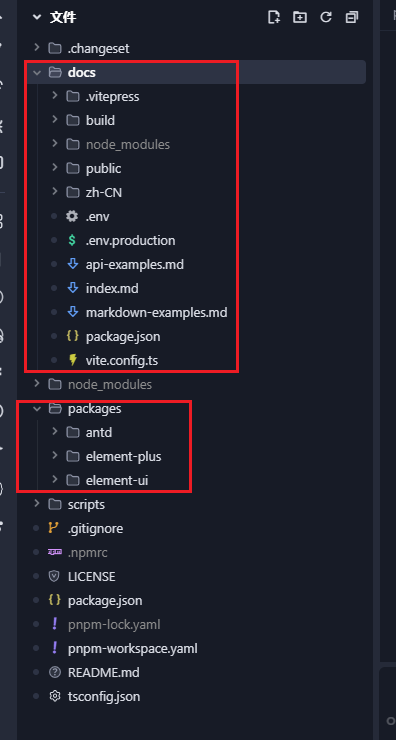
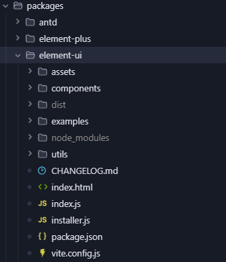
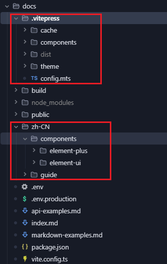

# 组件库搭建

搭建的组件库文档借助iframe能力，实现了element-ui,element-pluse,antd的组件库文档预览组件效果。

## 整体项目结构

packages目录中编写组件库，docs目录编写组件库文档




## 组件库项目开发与发布

### 项目结构

components目录中编写组件；expamples目录编写使用案例，使用router来访问组件案例页面，也是docs中访问组件库案例的原理。




### 组件打包

vite.config.js中配置输出不同导入格式的文件

```
build: {
    rollupOptions: {
        external: ['element-ui', 'vue'],
    },
    lib: {
        entry: resolve(__dirname, './components/index.js'),
        name: 'lzElementUI',
        fileName: 'lz-element-ui',
        formats: ['es', 'cjs', 'umd']
    }
},
```

配置packages.json

```
{
  "name": "@longzai-ui/longzai-element-ui",
  "version": "1.0.2",
  "description": "二次封装 element-ui",
  "main": "dist/lz-element-ui.cjs", // 入口文件
  "module": "dist/lz-element-ui.js", // Esmodule入口文件
  "type": "module", // es模式
  "scripts": {
    "dev": "vite",
    "build": "vite build",
    "docs:build": "vite build --mode docs"
  },
  // 配置为公共包，否则会发布失败
  "publishConfig": {
    "access": "public",
    "registry": "https://registry.npmjs.org"
  },
  "author": "longzai",
  // 使用组件库时所需的依赖
  "peerDependencies": {
    "element-ui": "^2.15.0",
    "vue": "^2.6.0"
  },
  "dependencies": {
    "@vitejs/plugin-vue2": "^2.3.3",
    "@vitejs/plugin-vue2-jsx": "^1.1.1",
    "less": "^4.1.3",
    "lodash-es": "^4.17.21",
    "vite": "^6.2.3"
  },
  "devDependencies": {
    "element-ui": "^2.15.6",
    "sass": "^1.86.0",
    "vue": "^2.7.16",
    "vue-router": "^3.5.3",
    "vue-template-compiler": "~2.6.0"
  }
}

```

### 组件库本地联调测试


在组件库目录中执行命令，发布到本地strore中
pnpm link --global

项目中链接包
pnpm link D:\myProjects\lz-UI\packages\element-ui --global

链接完成后node-modules会存在我们链接的包


### 发布

项目中使用changeset发布组件库，具体操作参考文章：https://www.longzai666.top/%E5%B7%A5%E7%A8%8B%E5%8C%96/pnpm%20+%20monorepo%20+%20changeset%E5%AE%9E%E7%8E%B0%E5%A4%9A%E5%8C%85%E7%AE%A1%E7%90%86%E5%92%8C%E5%8F%91%E5%B8%83


## 组件库文档

### 文档项目结构

.vitepress目录中配置vitepress相关配置，zh-CN目录中编写组件库文档。通过./vitepress/components/lz-demo.vue组件实现了组件的预览。



## 最后

组件库源码：https://github.com/dargon-start/lz-UI
实现原理参考文献：https://juejin.cn/post/7126477752718327839