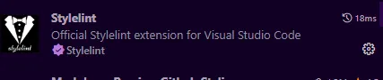

# 项目中如何使用Stylelint使用

### stylelint介绍

Stylelint 是一个强大、先进的 CSS 代码检查器（linter），可以帮助你规避 CSS 代码中的错误并保持一致的编码风格。

### stylelint作用

Stylelint 能帮助你 规避错误，例如
1. 无效的内容，例如：错误的 grid 定义
2. 有效但有问题的内容，例如：重复的选择器
3. 位置内容，例如：拼写错误的属性名

并能 强化规则，例如：
1. 禁止某些内容，例如：特定的数值单位
2. 强制命名规范，例如：针对自定义属性名
3. 设置边界，例如：ID 选择器的数量
4. 指定某些标记符号，例如：最新的处理颜色的函数


### 项目中使用stylelint
#### 1.安装依赖
安装如下依赖：

```json
"postcss": "^8.4.31",
"postcss-html": "^1.5.0",
"stylelint": "^15.10.3",
"stylelint-config-html": "^1.1.0",
"stylelint-config-prettier": "^9.0.5",
"stylelint-config-recommended-scss": "^13.0.0",
"stylelint-config-recommended-vue": "^1.5.0",
"stylelint-config-standard": "^34.0.0",
"stylelint-config-standard-scss": "^11.0.0",
"stylelint-order": "^6.0.3",
"stylelint-scss": "^5.2.1",
```

依赖说明：
* stylelint: css样式lint工具
* postcss: 转换css代码工具
* postcss-html: 识别html/vue 中的style标签中的样式
* stylelint-config-standard: 打开额外的规则来执行在规范和一些 CSS 样式指南中发现的通用约定，包括：惯用 CSS 原则，谷歌的 CSS 样式指南，Airbnb 的样式指南，和 @mdo 的代码指南。
* stylelint-config-standard-scss：扩展 stylelint-config-standard 共享配置，并为 SCSS 配置其规则
* stylelint-config-prettier: 关闭所有不必要或可能与Prettier冲突的规则
* stylelint-config-recommended-scss: scss的推荐可共享配置规则，详细可查看官方文档
* stylelint-config-standard-vue: lint.vue文件的样式配置
* stylelint-config-html : Stylelint 的可共享 HTML（和类似 HTML）配置，捆绑 postcss-html 并对其进行配置。
* stylelint-scss: stylelint-config-recommended-scss的依赖，scss的stylelint规则集合
* stylelint-order: 指定样式书写的顺序，在.stylelintrc.js中order/properties-order指定顺序
* stylelint-config-recess-order 配置stylelint css属性书写顺序插件


<font style="color:#FBDE28;">注意</font>：项目中使用的scss必须安装`stylelint-config-standard-scss`插件，他将按照scss标准来规范代码，如果只使用stylelint-config-standard，则会按照css标准来规范代码。

<br/>


<font style="color:#DF2A3F;">出现的问题：</font>

这是scss导入文件的形式

```json
@import "@/assets/scss/variable";
```

如果不使用stylelint-config-standard-scss，会将其自动修复为

```json
@import url("@/assets/scss/variable");
```


#### 2.在项目根目录中创建.stylelintrc.js文件
```javascript
module.exports = {
  plugins: ['stylelint-order'],
  extends: [
    "stylelint-config-standard", // 配置 stylelint 拓展插件
		"stylelint-config-html/vue", // 配置 vue 中 template 样式格式化
		"stylelint-config-standard-scss", // 配置 stylelint scss 插件
		"stylelint-config-recommended-vue/scss", // 配置 vue 中 scss 样式格式化
    'stylelint-config-recess-order', // 配置stylelint css属性书写顺序插件,
		"stylelint-config-prettier", // 配置 stylelint 和 prettier 兼容
  ],
  ignoreFiles: [
    '**/*.js',
    '**/*.cjs',
    '**/*.jsx',
    '**/*.tsx',
    '**/*.ts',
    '**/*.json',
    '**/*.md',
    '**/*.yaml',
    'node_modules/',
    'dist/',
    'public/',
    'docs/',
  ],
  overrides: [
    // {
    //   files: ['**/*.(scss|css)'],
    //   customSyntax: 'postcss-scss',
    // },
    {
      files: ['**/*.(html|vue)'],
      customSyntax: 'postcss-html',
    },
  ],
  rules: {
    // "selector-class-pattern": [ // 命名规范 -
    //     "^([a-z][a-z0-9]*)(-[a-z0-9]+)*$",
    //     {
    //         "message": "Expected class selector to be kebab-case"
    //     }
    // ],
    // "selector-pseudo-class-no-unknown": [
    //   true,
    //   {
    //     ignorePseudoClasses:['export']
    //   }
    // ]
    // "string-quotes":"single", // 单引号
    // "at-rule-empty-line-before": null,
    // "at-rule-no-unknown":null,
    // "at-rule-name-case": "lower",// 指定@规则名的大小写
    // "length-zero-no-unit": true,  // 禁止零长度的单位（可自动修复）
    // "shorthand-property-no-redundant-values": true, // 简写属性
    // "number-leading-zero": "never", // 小数不带0
    // "declaration-block-no-duplicate-properties": true, // 禁止声明快重复属性
    // "no-descending-specificity": true, // 禁止在具有较高优先级的选择器后出现被其覆盖的较低优先级的选择器。
    // "selector-max-id": 0, // 限制一个选择器中 ID 选择器的数量
    // "max-nesting-depth": 3,
    "scss/at-import-partial-extension": null, 
    'scss/dollar-variable-pattern': null, //解决类名不允许下划线
    'scss/double-slash-comment-whitespace-inside':null,// 解决双斜杠注释后要有一个空格
    'selector-class-pattern': null,
    'block-no-empty': null,
    'no-empty-source': null,
    'no-descending-specificity': null, // 禁止在具有较高优先级的选择器后出现被其覆盖的较低优先级的选择器
    'selector-pseudo-element-no-unknown': [
      true,
      {
        ignorePseudoElements: ['v-deep'],
      },
    ],
    'selector-pseudo-class-no-unknown': [
      true,
      {
        ignorePseudoClasses: ['deep'],
      },
    ],
    'font-family-no-missing-generic-family-keyword': null,
    'no-duplicate-selectors': null,
    'selector-id-pattern': null, //指定id选择器的模式
    'custom-property-pattern': null, //为自定义属性指定模式。
    'no-invalid-double-slash-comments': null, //禁止使用双斜杠注释（关闭）
    'at-rule-no-unknown': [
      true,
      {
        ignoreAtRules: ['mixin', 'if', 'else', 'include'],
      },
    ],
    'property-no-unknown': [
      true,
      {
        ignoreProperties: ['line-clamp'],
      },
    ],
    'indentation': [2],
    // 'order/properties-order': [ // 规则顺序
    //   'position',
    //   'content',
    //   'top',
    //   'right',
    //   'bottom',
    //   'left',
    //   'float',
    //   'display',
    //   'margin',
    //   'margin-top',
    //   'margin-right',
    //   'margin-bottom',
    //   'margin-left',
    //   'margin-collapse',
    //   'margin-top-collapse',
    //   'margin-right-collapse',
    //   'margin-bottom-collapse',
    //   'margin-left-collapse',
    //   'border',
    //   'border-radius',
    //   'outline',
    //   'outline-offset',
    //   'padding',
    //   'padding-top',
    //   'padding-right',
    //   'padding-bottom',
    //   'padding-left',
    //   'width',
    //   'height',
    //   'max-width',
    //   'max-height',
    //   'min-width',
    //   'min-height',
    //   'clip',
    //   'font',
    //   'font-family',
    //   'font-size',
    //   'font-smoothing',
    //   'osx-font-smoothing',
    //   'font-style',
    //   'font-weight',
    //   'line-height',
    //   'letter-spacing',
    //   'word-spacing',
    //   'text-align',
    //   'text-decoration',
    //   'text-indent',
    //   'text-overflow',
    //   'text-rendering',
    //   'text-size-adjust',
    //   'text-shadow',
    //   'text-transform',
    //   'word-break',
    //   'word-wrap',
    //   'white-space',
    //   'vertical-align',
    //   'list-style',
    //   'list-style-type',
    //   'list-style-position',
    //   'list-style-image',
    //   'pointer-events',
    //   'opacity',
    //   'filter',
    //   'visibility',
    //   'size',
    //   'transform',
    //   'background',
    //   'background-color',
    //   'color',
    //   'clear',
    //   'cursor',
    //   'overflow',
    //   'overflow-x',
    //   'overflow-y',
    //   'z-index',
    // ],
  },
}
```

#### 3.在package.json文件中添加执行脚本
```json
"scripts": {
	...
  
  "slint": "stylelint \"src/**/*.(vue|scss|css)\" --fix"
},
```

#### 4.安装vscode的Stylelint插件


安装该插件可在我们保存代码时自动执行stylelint

在`.vscode/settings.json`中添加以下规则

```json
{
  ...
  //自动修复的文件类型
  "stylelint.validate": ["css", "scss", "vue", "html"],

  "editor.codeActionsOnSave": {
    "source.fixAll.eslint": true,
    //启用stylelint保存时自动修复
    "source.fixAll.stylelint": true 
  },
}
```


### 样式写法：
1. 行内样式全部采用 以 - 间隔单词的写法 ，例如：`font-size:20px;`
2. 不能出现空注释

```javascript
//
.today{
	font-size:16px;
}
```


