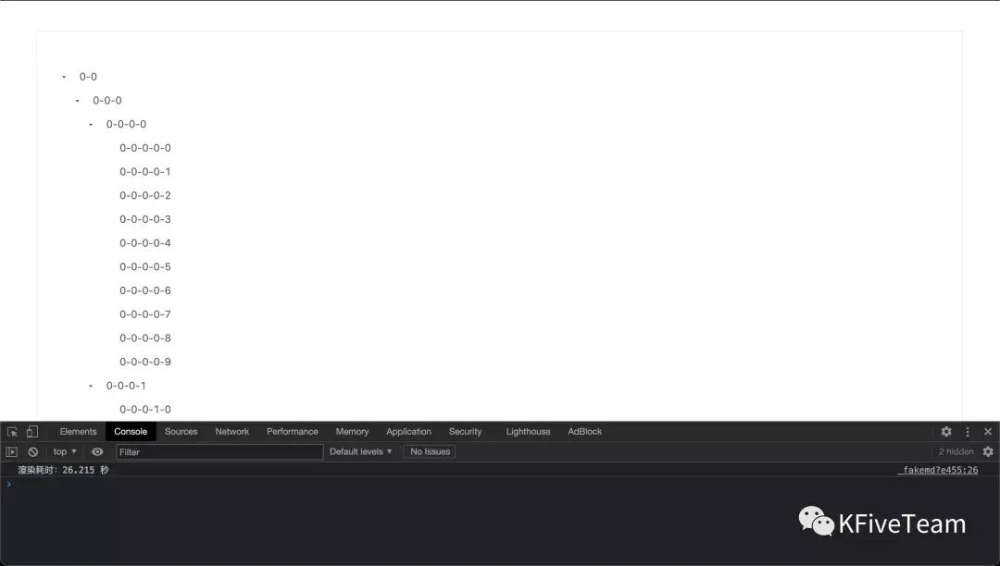
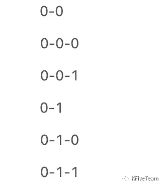
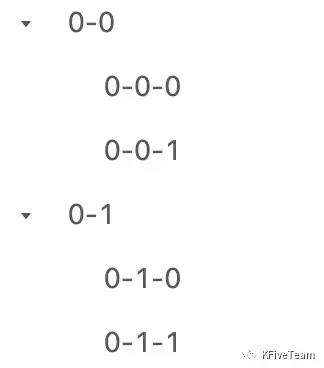
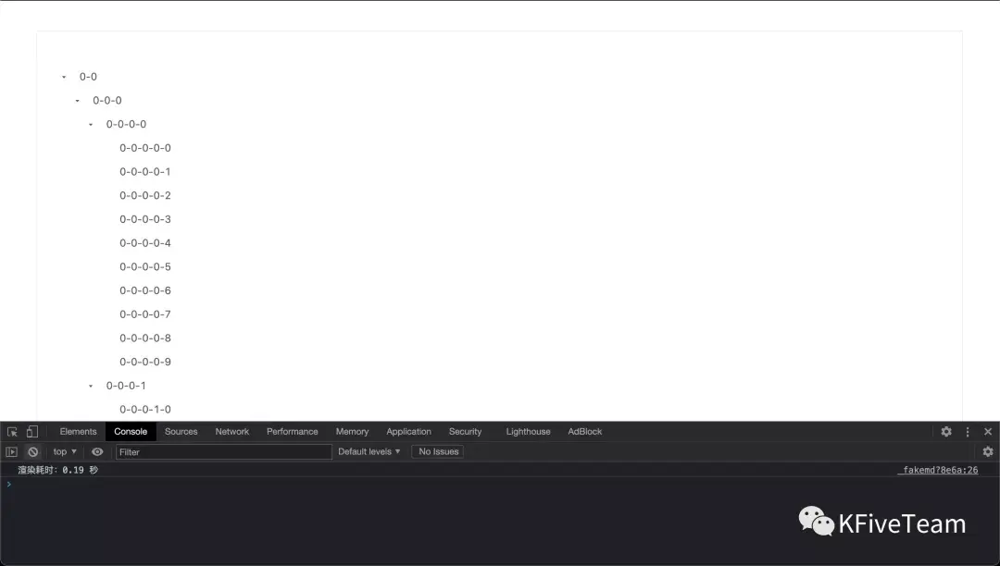

# 虚拟树

## 1.什么是虚拟树？
可能有的读者还知道一个概念，叫 “虚拟列表”。

虚拟树和虚拟列表本质其实是一样的，只不过前者的原始数据的结构是树，而后者的原始数据的结构是列表，以及最后的表现形式不一样。

不管是虚拟树还是虚拟列表，核心原理都是只渲染可视区域内的数据，也就是说，用户看不到的数据就不渲染了，这也是之所以称之为 “虚拟” 的原因。

一言以蔽之，虚拟树就是只渲染可视区域的数据的树。

## 2.为什么要用虚拟树？
因为渲染耗时。

如果一棵树含有海量数据，比如上万条，那么，这棵树的渲染耗时会很长。

我们可以通过一个实际的例子直观感受下。

下面的代码是使用 Santd 的普通树组件创建一个有 11110 个节点的树，代码的具体细节我们不需要关注，我们只需要知道它创建了一个有一万多个节点的树并打印出了树的渲染时间就可以了。

```
<template>
    <s-tree treeData="{{treeData}}" defaultExpandAll="{{true}}"></s-tree>
</template>

<script>
import {Tree} from 'santd';

function dig(path = '0', level = 3) {
    const list = [];
    for (let i = 0; i < 10; i += 1) {
        const key = `${path}-${i}`;
        const treeNode = {
            title: key,
            key,
        };

        if (level > 0) {
            treeNode.children = dig(key, level - 1);
        }

        list.push(treeNode);
    }
    return list;
}

const start = Date.now();
const treeData = dig();
setTimeout(() => {
    console.log(`渲染耗时：${(Date.now() - start) / 1000} 秒`);
}, 0);

export default {
    components: {
        's-tree': Tree
    },
    initData() {
        return {
            treeData
        }
    }
}
</script>
```


然后，我们就可以看到，这个 11110 个节点的树在我的 2019 款的 MacBook Pro 的 Chrome 里渲染了 26 秒，将近半分钟。



这么长的耗时一般是不能接受的，所以我们需要想办法解决这个问题，这就可以用到虚拟树了。

虚拟树可以通过只渲染海量数据中的那部分在可视区域的数据来大幅缩短渲染耗时。

## 3.怎么实现虚拟树？

实现虚拟树的思路是，先把实现虚拟树转化成实现虚拟列表，然后在展示的时候把列表装饰得像一棵树。

根据这个思路，可以把实现虚拟树的过程大致分为 4 步：

1. 把树结构的原始数据拍平；

2. 计算哪些数据在可视区域；

3. 模拟滚动；

4. 把列表装饰成树。

接下来我们就一步一步来看。
暂时不需要过多地关注代码细节，可以先整体把握虚拟树的实现步骤和原理，然后之后有需要的话再回头来细看代码。

### 3.1 把树结构的原始数据拍平
我们用简单的原始数据来说明这一步。

原始数据会是像下面这样的树结构的：


```
const treeData = [
    {
        key: '0-0',
        children: [
            {
                key: '0-0-0'
            },
            {
                key: '0-0-1'
            }
        ]
    },
    {
        key: '0-1',
        children: [
            {
                key: '0-1-0'
            },
            {
                key: '0-1-1'
            }
        ]
    }
];
```

这是一棵简单的树，深度为 2，一级节点有 2 个，每个一级节点又各自有 2 个二级节点，所以一共是 6 个节点。

然后我们要把它拍平，拍平的关键是按深度优先把树遍历一遍，拍平的逻辑如下：


```
function flattenTreeData(treeData) {
    const flatNodes = [];
    const dig = treeData =>
        treeData.forEach(treeNode => {
            flatNodes.push(treeNode);

            dig(treeNode.children || []);
        });

     dig(treeData);

    return flatNodes;
}
```

拍平之后的数据会像是下面这样的，这里需要重点关注下，因为之后我们的所有处理都是基于这个拍平后得到的数组。

拍平后，全部的节点都成为了最外层的数组的项（原来只有一级节点是最外层的数组的项）。


```
const flatNodes = [
    {
        key: '0-0',
        children: [
            {
                key: '0-0-0'
            },
            {
                key: '0-0-1'
            }
        ]
    },
    {
        key: '0-0-0'
    },
    {
        key: '0-0-1'
    },
    {
        key: '0-1',
        children: [
            {
                key: '0-1-0'
            },
            {
                key: '0-1-1'
            }
        ]
    },
    {
        key: '0-1-0'
    },
    {
        key: '0-1-1'
    }
];
```
这时，如果我们把这个数组遍历一遍并绘制在页面上（即列表渲染），得到的节点的顺序和把原始数据渲染成树时的节点的顺序是一致的，只不过前者没有缩进，看起来是个列表，而后者有缩进，看起来是个树，如下面两张图所示。




### 3.2 计算哪些数据在可视区域
实际上我们需要处理的数据会有很多，而我们只需要渲染出来其中的一部分，即在可视区域的那部分，所以我们需要计算到底是哪些数据在可视区域。

可视区域的高度是固定的，假设树的每一个节点的高度也是固定的，那么，根据这两个数据，我们就可以计算出可视区域内能展示多少个节点。


```
// VISIBLE_HEIGHT 可视区域的高度

// NODE_HEIGHT 树的节点的高度

// visibleCount 可视区域内能展示多少个节点

const visibleCount = Math.ceil(VISIBLE_HEIGHT / NODE_HEIGHT);
```

然后，如果我们再知道可视区域里的第一个节点在数组中的索引，就可以知道到底是哪些数据在可视区域了。

而可视区域里的第一个节点的索引，可以通过当前的滚动距离除以节点高度获得。


```
// scrollTop 当前的滚动距离（即当前位置距离页面顶部的距离）

// start 可视区域的第一个节点的索引

let start = Math.floor(scrollTop / NODE_HEIGHT);
```

这下，我们就知道哪些数据在可视区域了。

```
let visibleNodes = flatNodes.slice(start, Math.min(start + visibleCount, flatNodes.length));
```

### 3.3 模拟滚动

因为我们实际上只渲染了可视区域的数据，而如果只有这些数据，自然是不能像渲染全部数据时那样可以通过滚动页面来浏览全部数据，所以我们还需要模拟滚动。

模拟好滚动后，随着滚动，会动态修改可视区域的数据，就能像渲染全部数据时那样通过滚动页面来浏览全部数据了。

为了模拟滚动，我们需要这样的 HTML 结构：

```
<div class="virtual-tree" style="height: 500px; overflow: scroll; position: relative;" on-scroll="scrollEvent">
    <div class="tree-phantom" style="height: {{totalHeight}}px;"></div>
    <ul class="visible-tree-nodes" style="position: absolute; top: {{top}}px">
        <s-tree-node s-for="node in visibleNodes" nodeData="{{node}}"></s-tree-node>
    </ul>
 </div>
 ```
s-tree-node 是树节点组件，传入树节点的数据即可渲染树节点。
最外层的元素（class 为 virtual-tree）是滚动容器，设置了 overflow: scroll;，它同时也是可视区域，高度是固定的。

滚动容器的第一个子元素（class 为 tree-phantom）是模拟滚动的关键，它是一个占位元素，高度是树的总高度，由节点高度乘节点数量得到。这个占位元素用树的真实高度撑开了滚动容器，因此滚动容器就可以滚动了。

滚动容器的第二个子元素（class 为 visible-tree-nodes），我们称之为渲染元素，负责渲染我们计算出来的在可视区域的数据。它是相对滚动容器（最外层的元素）定位的，初始位置是在滚动容器的顶部。随着容器的滚动，我们不仅需要如之前所说，更新可视区域的数据，同时，我们还需要更新渲染元素的垂直偏移量，即上面代码中的 top 的值，不然理应展示在可视区域的数据会跑到可视区域外。

```
// 滚动时触发的事件函数，负责更新可视区域的数据和更新渲染元素的垂直偏移量
scrollEvent() {
    // 当前的滚动位置
    const scrollTop = ducument.querySelector('virtual-tree').scrollTop;
    // 更新可视区域的第一个节点的索引
    // 在真实实现中，visibleNodes（可视区域的数据）是计算属性，因此会随着 start（可视区域的第一个节点的索引）更新而自动更新
    this.data.set('start', Math.floor(scrollTop / NODE_HEIGHT));

    // 更新渲染元素的偏移量
    this.data.set('top', scrollTop - (scrollTop % NODE_HEIGHT));
}

```

至此，模拟滚动就完成了。

### 3.4 把列表装饰成树

到这一步时，虚拟树的基本功能我们都已经实现了，但是这棵树本质上是个列表，比如没有层级缩进（如之前所示），所以我们还需要把这个列表装饰成树的样子。

这一步的主要工作是写 CSS，这部分内容就不是今天的重点了，所以我们略过吧～

### 4 最终效果
最后，还是 11110 个节点，我们来看下用虚拟树时的渲染耗时：


0.19 秒，比原来的 26 秒快了 99%。

相当震撼。

这个虚拟树的功能已在 Santd 的 Tree 组件里实现，有兴趣的朋友可以前往 Santd 的官方文档和代码库进一步了解：

Santd 官网文档：https://ecomfe.github.io/sant...

Santd 代码库：https://github.com/ecomfe/san...


参考资料：https://segmentfault.com/a/1190000040933163#item-1