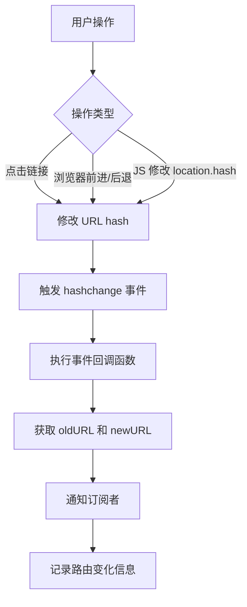
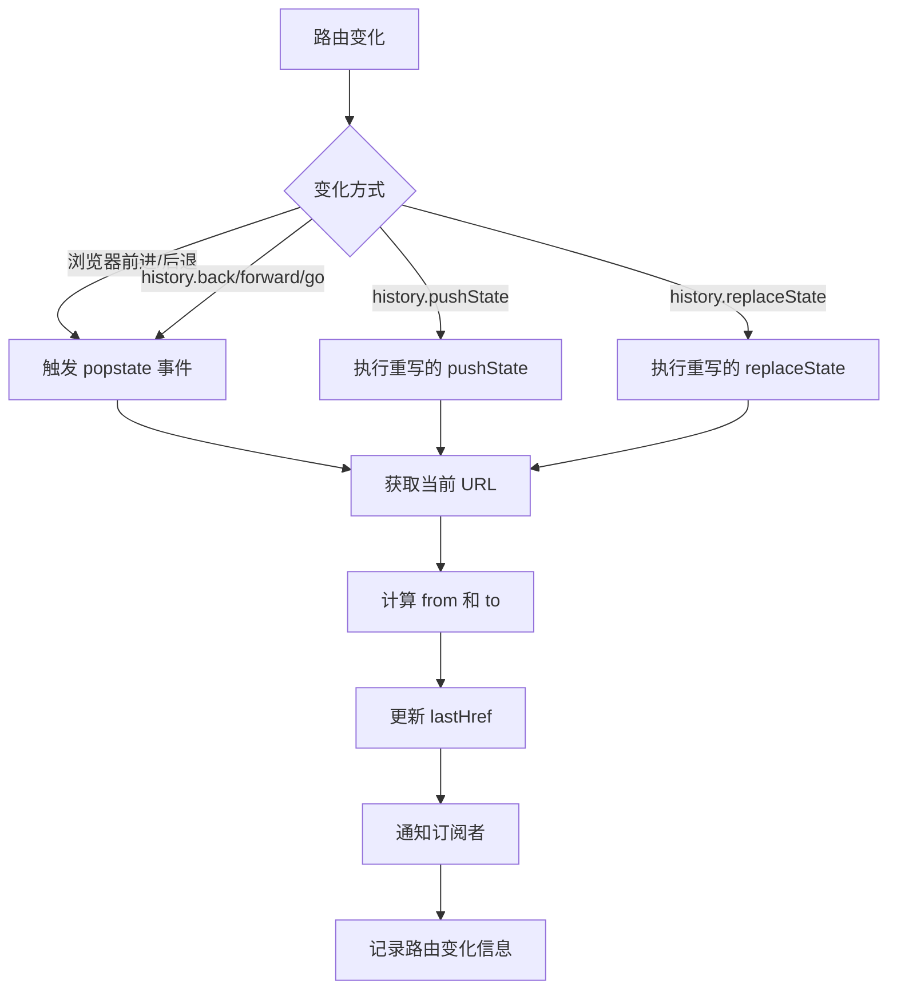

# Hash 和 History 路由监听原理详解

## 一、前言

在前端单页应用（SPA）中,路由是实现页面切换的核心机制。目前主流的路由模式有两种：**Hash 模式**和 **History 模式**。对于前端监控系统来说,监听路由变化是追踪用户行为、记录页面访问路径的重要手段。本文将深入分析这两种路由模式的监听原理及其实现细节。

## 二、Hash 路由监听原理

### 2.1 什么是 Hash 路由

Hash 路由是利用 URL 中的 hash（`#`）来模拟一个完整的 URL,当 hash 发生变化时,页面不会重新加载。例如：
```
https://example.com/#/home
https://example.com/#/about
```

### 2.2 Hash 路由的特点

- **兼容性好**：支持所有浏览器（包括 IE8+）
- **不需要服务端配置**：hash 部分不会发送到服务器
- **URL 带有 `#` 符号**：视觉上不够美观
- **SEO 不友好**：搜索引擎一般不会爬取 hash 后面的内容

### 2.3 监听原理

Hash 路由的监听主要依赖于浏览器提供的 `hashchange` 事件。

#### 2.3.1 触发时机

`hashchange` 事件在以下情况会被触发：
1. 通过浏览器前进、后退按钮操作
2. 通过 `<a>` 标签改变 URL 的 hash 值
3. 通过 JavaScript 修改 `window.location.hash`

#### 2.3.2 实现代码

```typescript
function listenHashchange(): void {
  // 检查浏览器是否支持 hashchange 事件
  if (isExistProperty(_global, 'onhashchange')) {
    // 添加事件监听器
    on(_global, EVENTTYPES.HASHCHANGE, function (e: HashChangeEvent) {
      // 通知订阅者,路由发生了变化
      notify(EVENTTYPES.HASHCHANGE, e);
    });
  }
}
```

#### 2.3.3 HashChangeEvent 对象

`HashChangeEvent` 对象包含以下重要属性：

| 属性 | 说明 | 示例 |
|------|------|------|
| `oldURL` | 变化前的完整 URL | `https://example.com/#/home` |
| `newURL` | 变化后的完整 URL | `https://example.com/#/about` |

#### 2.3.4 使用示例

```javascript
window.addEventListener('hashchange', function(e) {
  console.log('从:', e.oldURL);
  console.log('到:', e.newURL);
  console.log('当前 hash:', window.location.hash);
});

// 改变 hash,触发 hashchange 事件
window.location.hash = '#/about';
```

### 2.4 监听流程图



## 三、History 路由监听原理

### 3.1 什么是 History 路由

History 路由是利用 HTML5 提供的 History API 来实现路由切换,URL 看起来和正常的 URL 一样。例如：
```
https://example.com/home
https://example.com/about
```

### 3.2 History 路由的特点

- **URL 更美观**：没有 `#` 符号
- **更符合 RESTful 规范**：URL 路径清晰
- **需要服务端配置**：所有路由都需要指向同一个 HTML 文件
- **兼容性要求**：需要 HTML5 支持（IE10+）
- **SEO 友好**：URL 可被搜索引擎正常索引

### 3.3 监听原理

History 路由的监听相对复杂,需要同时监听 `popstate` 事件和重写 `pushState`、`replaceState` 方法。

#### 3.3.1 核心 API

History 对象提供了以下关键方法：

| 方法 | 说明 | 是否触发 popstate |
|------|------|-------------------|
| `pushState(state, title, url)` | 添加一条历史记录 | ❌ 否 |
| `replaceState(state, title, url)` | 替换当前历史记录 | ❌ 否 |
| `back()` | 后退 | ✅ 是 |
| `forward()` | 前进 | ✅ 是 |
| `go(n)` | 跳转到指定历史记录 | ✅ 是 |

> [!IMPORTANT]
> **核心难点**：`pushState` 和 `replaceState` **不会触发** `popstate` 事件,这是 History 路由监听的关键问题。

#### 3.3.2 实现代码

```typescript
// 保存上一次的路由地址
let lastHref: string = getLocationHref();

function historyReplace(): void {
  // 检查浏览器是否支持 History API
  if (!supportsHistory()) return;
  
  // 1️⃣ 监听 popstate 事件（浏览器前进/后退）
  const oldOnpopstate = _global.onpopstate;
  _global.onpopstate = function (this: any, ...args: any): void {
    const to = getLocationHref();
    const from = lastHref;
    lastHref = to;
    
    // 通知订阅者
    notify(EVENTTYPES.HISTORY, {
      from,
      to
    });
    
    // 执行原有的 onpopstate 回调
    oldOnpopstate && oldOnpopstate.apply(this, args);
  };
  
  // 2️⃣ 重写 pushState 和 replaceState
  function historyReplaceFn(originalHistoryFn: voidFun): voidFun {
    return function (this: any, ...args: any[]): void {
      // pushState/replaceState 的第三个参数是 url
      const url = args.length > 2 ? args[2] : undefined;
      if (url) {
        const from = lastHref;
        const to = String(url);
        lastHref = to;
        
        // 通知订阅者
        notify(EVENTTYPES.HISTORY, {
          from,
          to
        });
      }
      
      // 调用原始方法
      return originalHistoryFn.apply(this, args);
    };
  }
  
  // 重写 pushState
  replaceAop(_global.history, 'pushState', historyReplaceFn);
  // 重写 replaceState
  replaceAop(_global.history, 'replaceState', historyReplaceFn);
}
```

#### 3.3.3 实现要点分析

##### （1）为什么需要保存 `lastHref`？

由于路由监听需要知道「从哪里来」和「到哪里去」,我们需要在全局维护一个 `lastHref` 变量：

```typescript
let lastHref: string = getLocationHref();
```

每次路由变化时：
1. 将当前 URL 保存为 `to`
2. 将 `lastHref` 作为 `from`
3. 更新 `lastHref` 为当前 URL

##### （2）为什么要保存原有的 `onpopstate`？

```typescript
const oldOnpopstate = _global.onpopstate;
// ...
oldOnpopstate && oldOnpopstate.apply(this, args);
```

这样做是为了：
- **避免覆盖**：业务代码可能已经定义了 `onpopstate` 回调
- **链式调用**：确保原有的回调也能被执行
- **不影响业务逻辑**：监控代码应该是无侵入的

##### （3）`replaceAop` 的作用

`replaceAop` 是一个面向切面编程（AOP）的工具函数,用于在不修改原函数的情况下增强其功能：

```typescript
// 简化版实现
function replaceAop(source, name, replacementFactory) {
  const original = source[name];
  const replacement = replacementFactory(original);
  source[name] = replacement;
}
```

应用场景：
```typescript
// 重写 pushState
replaceAop(_global.history, 'pushState', historyReplaceFn);
```

等价于：
```typescript
const originalPushState = history.pushState;
history.pushState = function(...args) {
  // 监控逻辑
  notify(EVENTTYPES.HISTORY, { from, to });
  // 调用原始方法
  return originalPushState.apply(this, args);
};
```

#### 3.3.4 监听流程图



### 3.4 完整示例

```javascript
// 初始化
let lastHref = window.location.href;

// 1. 监听 popstate
window.addEventListener('popstate', function(e) {
  const to = window.location.href;
  const from = lastHref;
  lastHref = to;
  console.log('popstate - 从:', from, '到:', to);
});

// 2. 重写 pushState
const originalPushState = history.pushState;
history.pushState = function(...args) {
  const url = args[2];
  if (url) {
    const from = lastHref;
    const to = String(url);
    lastHref = to;
    console.log('pushState - 从:', from, '到:', to);
  }
  return originalPushState.apply(this, args);
};

// 3. 重写 replaceState
const originalReplaceState = history.replaceState;
history.replaceState = function(...args) {
  const url = args[2];
  if (url) {
    const from = lastHref;
    const to = String(url);
    lastHref = to;
    console.log('replaceState - 从:', from, '到:', to);
  }
  return originalReplaceState.apply(this, args);
};

// 测试
history.pushState(null, '', '/home');    // 会被监听到
history.replaceState(null, '', '/about'); // 会被监听到
history.back();                           // 触发 popstate
```

## 四、两种路由模式对比

| 特性 | Hash 路由 | History 路由 |
|------|----------|--------------|
| **URL 格式** | `example.com/#/path` | `example.com/path` |
| **美观度** | ❌ 有 `#` 符号 | ✅ 无 `#` 符号 |
| **监听事件** | `hashchange` | `popstate` + 重写方法 |
| **实现难度** | ⭐ 简单 | ⭐⭐⭐ 复杂 |
| **兼容性** | ✅ IE8+ | ⚠️ IE10+ |
| **服务端配置** | ❌ 不需要 | ✅ 需要配置 |
| **SEO** | ❌ 不友好 | ✅ 友好 |
| **监听完整度** | ✅ 事件自动触发 | ⚠️ 需要手动重写 API |

