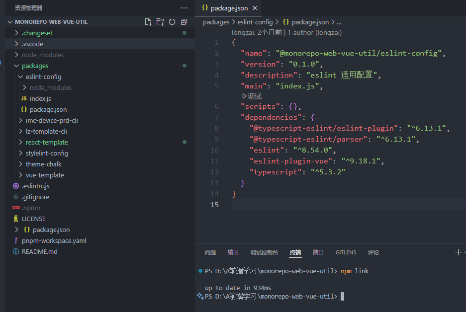
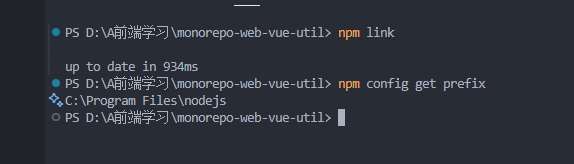
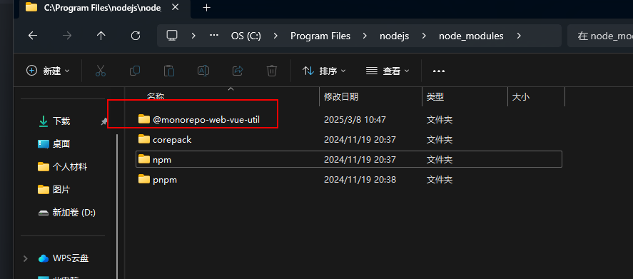
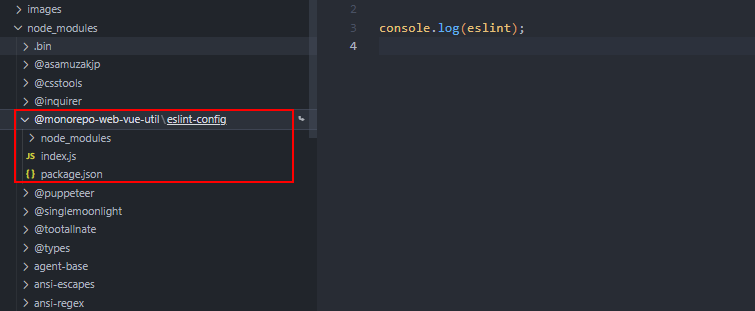

# 本地npm如何在项目中联调测试呢？

本地如果我们想要安装另一个本地npm包，可以使用`npm link`

## 将npm包链接到全局node_modules

在npm包目录下执行npm link，在全部node_modules中创建一个链接指向该包

确认全部node-modules位置

`npm config get prefix` 

可以看到在node_modules中增加了一个@monorepo-web-vue-util，这个就是上面link的npm包名。

## 项目中npm包

使用`npm link <包名>`， 来链接到本地包进行使用。

可以看到在项目的node_modules中增加了一个@monorepo-web-vue-util/eslint-config

