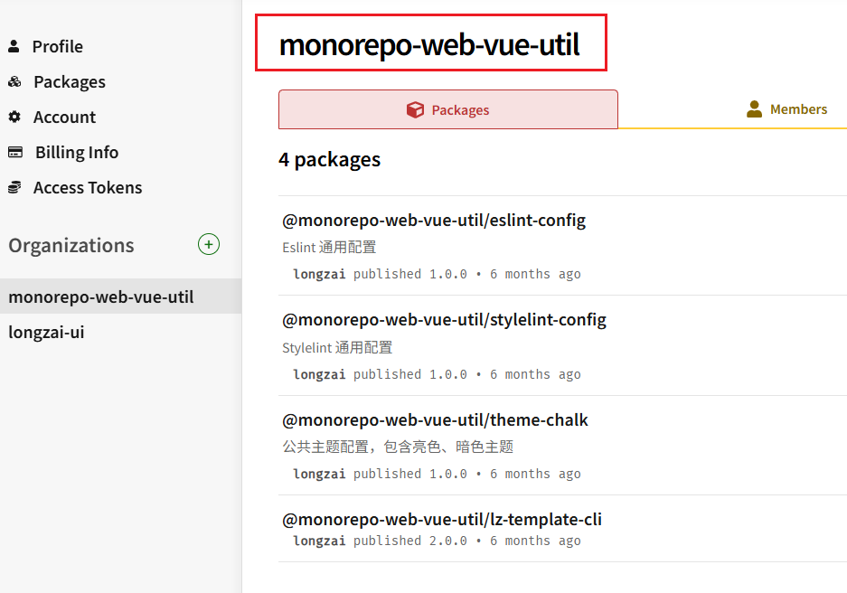

# pnpm + monorepo + changeset实现多包管理和发布

## npm 发包网络超时问题：
1. 打开vpn
2. 配置npm 代理 npm config set proxy http://127.0.0.1:7890


## 发布monerepo包
发布monerepo包需要在npm上创建Organizations


使用changeset 工具发包
1. pnpm install @changesets/cli -w --save-dev 下载工具
2. pnpm changeset init 初始化
3. 执行命令pnpm changeset 或 pnpm changeset add，该命令将询问一系列问题，提示你选择需要发布的包、指定版本类型（major、minor、patch），并输入变更描述。完成后，Changesets 会生成一个 changeset 的 Markdown 文件。
4. pnpm changest version 更新版本号
5. 执行 pnpm changeset publish 发布

### 预发模式

在测试阶段，我们需要发布预发版本提供给测试。

创建预发布分支，Changesets 强烈建议从独立分支（非 main）运行预发布流程，避免阻塞主分支的正常开发。

完整命令示例

```
git checkout -b release-beta  # 创建预发布分支
pnpm changeset pre enter beta # 进入预发布模式
pnpm changeset                # 生成 Changeset
pnpm changeset version        # 更新版本号（如 1.0.0-beta.0）
git add . && git commit -m "chore: enter prerelease mode"
pnpm changeset publish        # 发布预发布版本
git push --follow-tags # 推送版本号标签
```

在完成测试后，退出预发模式，发布latest

```
pnpm changeset pre exit # 退出预发模式
pnpm changeset version
git add .
git commit -m "Exit prerelease mode and version packages"
pnpm changeset publish
git push --follow-tags
```