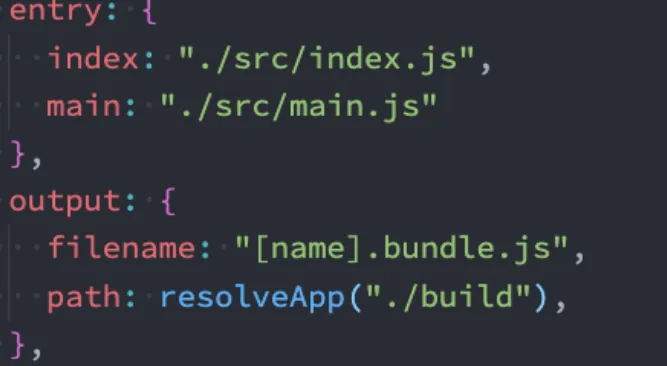
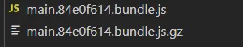

# 性能优化
## 打包代码分离


当我们很多文件，打包后都打包到了bundle.js一个文件当中，这肯定是不友好的，在浏览器加载bundle.js文件时，可能会耗费大量的时间。因此，我们可以将打包的文件进行分离，实现文件的懒加载效果。

### 1.多入口
配置多入口，打包时，会将文件打包到独立的文件当中。



### 2.入口依赖
如果在上例中，index.js和main.js都使用到了lodash这个第三方库，那么该库会被打包两次。

我们可以通过共享依赖来解决该问题。

```json
  entry: {
    index:{import:'./src/index.js',dependOn:'shared'},
    main:{import:'./src/main.js',dependOn:'shared'},
    shared:['lodash']
  },
```

### SplitChunks
通过splitChunks的分包模式来进行代码分离。

主要是通过optimization属性来配置优化。 

配置地址：[https://webpack.docschina.org/configuration/optimization/#optimizationchunkids](https://webpack.docschina.org/configuration/optimization/#optimizationchunkids)

#### <font style="color:rgb(50, 67, 74);">optimization.chunkIds</font>
<font style="color:rgb(43, 58, 66);">告知 webpack 当选择模块 id 时需要使用哪种算法。将 </font><font style="color:rgb(43, 58, 66);">optimization.chunkIds</font><font style="color:rgb(43, 58, 66);"> 设置为 </font><font style="color:rgb(43, 58, 66);">false</font><font style="color:rgb(43, 58, 66);"> 会告知 webpack 没有任何内置的算法会被使用，但自定义的算法会由插件提供。</font>

+ <font style="color:rgb(43, 58, 66);">如果环境是开发环境，那么 </font><font style="color:rgb(43, 58, 66);">optimization.chunkIds</font><font style="color:rgb(43, 58, 66);"> 会被设置成 </font><font style="color:rgb(43, 58, 66);">'named'</font><font style="color:rgb(43, 58, 66);">，但当在生产环境中时，它会被设置成 </font><font style="color:rgb(43, 58, 66);">'deterministic'</font>

| <font style="color:rgb(43, 58, 66);">'natural'</font> | <font style="color:rgb(43, 58, 66);">按使用顺序的数字 id。</font> |
| --- | --- |
| <font style="color:rgb(43, 58, 66);">'named'</font> | <font style="color:rgb(43, 58, 66);">对调试更友好的可读的 id。</font> |
| <font style="color:rgb(43, 58, 66);">'deterministic'</font> | <font style="color:rgb(43, 58, 66);">在不同的编译中不变的短数字 id。有益于长期缓存。在生产模式中会默认开启。</font> |


#### cacheGroups
<font style="color:rgb(43, 58, 66);">缓存组可以继承和/或覆盖来自 </font><font style="color:rgb(43, 58, 66);">splitChunks.*</font><font style="color:rgb(43, 58, 66);"> 的任何选项。但是 </font><font style="color:rgb(43, 58, 66);">test</font><font style="color:rgb(43, 58, 66);">、</font><font style="color:rgb(43, 58, 66);">priority</font><font style="color:rgb(43, 58, 66);"> 和 </font><font style="color:rgb(43, 58, 66);">reuseExistingChunk</font><font style="color:rgb(43, 58, 66);"> 只能在缓存组级别上进行配置。将它们设置为 </font><font style="color:rgb(43, 58, 66);">false</font><font style="color:rgb(43, 58, 66);">以禁用任何默认缓存组。</font>

```json
optimization: {
  chunkIds:'named',// 
  splitChunks: {
    // include all types of chunks
    chunks: 'all', // 异步和通过加载的模块都进行分包
    cacheGroups: {
      Vendors: {
        test: /[\\/]node_modules[\\/]/,
        priority: -10,//优先级
        filename:'[id]_vendors.js'
      },
      default: {
        minChunks: 1,
        priority: -20,
        filename:'common_[name].js'
      },
    },
  },
},
```


#### 预加载（preload）和预获取（prefetch）
在项目当中我们使用了懒加载来实现加载的优化，但是如果加载的内容比较大，当我们触发一个事件时在加载相应的资源，会有很大的响应等待时间。因此我们可以使用预加载或预获取未来某个时刻我们需要的资源。

prelaod:获取当前导航下可能需要的资源

prefetch:获取将来某些导航下可能需要的资源。


> <font style="color:rgb(43, 58, 66);">与 prefetch 指令相比，preload 指令有许多不同之处：</font>
>
> + <font style="color:rgb(43, 58, 66);">preload chunk 会在父 chunk 加载时，以并行方式开始加载。prefetch chunk 会在父 chunk 加载结束后开始加载。</font>
> + <font style="color:rgb(43, 58, 66);">preload chunk 具有中等优先级，并立即下载。prefetch chunk 在浏览器闲置时下载。</font>
> + <font style="color:rgb(43, 58, 66);">preload chunk 会在父 chunk 中立即请求，用于当下时刻。prefetch chunk 会用于未来的某个时刻。</font>
> + <font style="color:rgb(43, 58, 66);">浏览器支持程度不同。</font>
>

<font style="color:rgb(43, 58, 66);"></font>

<font style="color:rgb(43, 58, 66);">案例：触发事件时加载资源，使用prefetch可以在浏览器加载完父chunk并且空闲是提前加载xix.js资源，实现预获取的功能。</font>

```javascript
const btn = document.createElement('button');
btn.innerHTML = '获取资源'
btn.addEventListener('click',function(){
  import(/* webpackPrefetch:true */'./js/xix.js')
})
document.body.appendChild(btn)
```

### cdn打包优化
##### 项目代码打包配置
如果要将项目部署到cdn服务器上，那么要配置打包的publicPath;

```json
output: {
  filename: '[name].bundle.js',
  path: path.resolve(__dirname, './dist'),
  chunkFilename: 'chunk_[id]_[name].js',
  publickPath:'' //cdn地址
},
```


##### 第三方包打包优化
例如我们要cdn引入lodash和dayjs库。


1. 配置webpack，不打包这两个库

webpack.config.js

```json
//生产环境下配置
externals: {
  lodash: '_',
  dayjs: 'dayjs'
},
```

2. 在模板index.html中手动引入cdn地址，通过ejs来判断是否为生产环境，只有在生产环境下才使用cdn引入。

```json
 <% if(process.env.NODE_ENV === 'production'){   %>
    <script src="https://unpkg.com/dayjs@1.8.21/dayjs.min.js"></script>
    <script src="https://cdn.jsdelivr.net/npm/lodash@4.17.21/lodash.min.js"></script>
<% } %>
```


常用的开源cdn服务：

国际上使用比较多的是unpkg、JSDelivr、cdnjs； 

国内也有一个比较好用的CDN是bootcdn； 


### css打包优化
MiniCssExtractPlugin可以帮助我们将css提取到一个独立的css文件中<font style="color:rgb(89,89,89);">。</font>

<font style="color:rgb(89,89,89);">安装依赖</font>

`npm install mini-css-extract-plugin -D `

配置：

在webpack.com.config.js中使用插件

```javascript
const MiniCssExtractPlugin = require('mini-css-extract-plugin');
//使用插件
plugins: [
  new MiniCssExtractPlugin({
    filename: 'css/[name][contenthash:8].css',
    chunkFilename: 'css/[name][contenthash:8].css'
  })
],
```

在webpack.pro.config.js使用MiniCssExtractPlugin的loader

```javascript
rules: [{
  test: /\.css$/, // 匹配.css文件,
  exclude: /node_modules/,
  use: [
    MiniCssExtractPlugin.loader, //使用loader
    {
      loader: 'css-loader',
      options: {
        importLoaders: 1,
        // 0 => no loaders (default);
        // 1 => postcss-loader;
        // 2 => postcss-loader, sass-loader
      },
    },
    {
      loader: 'postcss-loader',
      options: {
        postcssOptions: {
          plugins: [require('postcss-preset-env')],
          
        },
      },
    },
  ], // 使用css-loader,style-loader
}, ]
```

在webpack.dev.config.js依旧使用style-loader。

```javascript
rules: [{
  test: /\.css$/, // 匹配.css文件,
  exclude: /node_modules/,
  use: [
    'style-loader',
    {
      loader: 'css-loader',
      options: {
        importLoaders: 1,
        // 0 => no loaders (default);
        // 1 => postcss-loader;
        // 2 => postcss-loader, sass-loader
      },
    },
    {
      loader: 'postcss-loader',
      options: {
        postcssOptions: {
          plugins: [require('postcss-preset-env')],

        },
      },
    },
  ], // 使用css-loader,style-loader
}, ]
```


最后,这样我们就完成了再生产环境时，将css打包到单独的文件的效果了。而在开发环境依旧是打包到style标签当中。

#### hash,contenthash,chunckhash
> <font style="color:rgb(89,89,89);">在我们给打包的文件进行命名的时候，会使用placeholder，placeholder中有几个属性比较相似： </font>
>
> <font style="color:rgb(89,89,89);"> hash、chunkhash、contenthash </font>
>
> <font style="color:rgb(89,89,89);"> hash本身是通过MD4的散列函数处理后，生成一个128位的hash值（32个十六进制）； </font>
>
> <font style="color:rgb(89,89,89);">hash值的生成和整个项目有关系： </font>
>
> <font style="color:rgb(89,89,89);">比如我们现在有两个入口index.js和main.js； </font>
>
> <font style="color:rgb(89,89,89);"> 它们分别会输出到不同的bundle文件中，并且在文件名称中我们有使用hash； </font>
>
> <font style="color:rgb(89,89,89);"> 这个时候，如果修改了index.js文件中的内容，那么hash会发生变化； </font>
>
> <font style="color:rgb(89,89,89);"> 那就意味着两个文件的名称都会发生变化； </font>
>
> <font style="color:rgb(89,89,89);"> chunkhash可以有效的解决上面的问题，它会根据不同的入口进行借来解析来生成hash值： </font>
>
> <font style="color:rgb(89,89,89);"> 比如我们修改了index.js，那么main.js的chunkhash是不会发生改变的； </font>
>
> <font style="color:rgb(89,89,89);"> contenthash表示生成的文件hash名称，只和内容有关系： </font>
>
> <font style="color:rgb(89,89,89);"> 比如我们的index.js，引入了一个style.css，style.css有被抽取到一个独立的css文件中； </font>
>
> <font style="color:rgb(89,89,89);">这个css文件在命名时，如果我们使用的是chunkhash； </font>
>
> <font style="color:rgb(89,89,89);">那么当index.js文件的内容发生变化时，css文件的命名也会发生变化； </font>
>
> <font style="color:rgb(89,89,89);">这个时候我们可以使用contenthash；</font>
>


案例：

```javascript
output: {
  filename: '[name].[hash:8].bundle.js',
    path: path.resolve(__dirname, '../dist'),
      chunkFilename: 'chunk_[id]_[name].js',
}

plugins: [
  new MiniCssExtractPlugin({
    //打包的css文件名，只与自身内容有关
    filename: 'css/[name][contenthash:8].css',
    chunkFilename: 'css/[name][contenthash:8].css'
  })
]
```

建议使用contenthash，因为当内容不变时，打包后文件名改变了，那么浏览器就要重新加载该文件资源，会造成资源加载耗时。

#### css-minimizer-webpack-plugin 压缩css文件
主要用来去除无用的空格等。

安装：

`npm install css-minimizer-webpack-plugin -D `

在wepback.pro.config.js中配置：

```javascript
module.exports = {
 optimization: {
        minimize: true,
        minimizer: [
            new CssminimizerPlugin()
        ]
    },
}
```

### terser
github地址： [https://github.com/terser/terser](https://github.com/terser/terser)

Terser是一个JavaScript的解释（Parser）、Mangler（绞肉机）/Compressor（压缩机）的工具集。

在webpack中，production环境默认就是使用`terser-webpack-plugin`对代码进行处理的。

我们也可以配置自己的想实现的功能。

案例：配置打包后去除console,debugger

```javascript
module.exports = {
  optimization: {
    minimize: true,//自定义配置，minimize需要设置为true
    minimizer: [
      new TerserPlugin({
        parallel: true,
        terserOptions: {
          compress: {
            drop_debugger: true, //去除debugger
            drop_console: true //去除console
          }
        },
      }),
    ]
  },
}
```


### tree shaking
tree shaking 用于消除我们项目无用的代码（没有使用的代码）。

有两种优化的手段：

1. usedExports: 通过标记某些函数是否被使用，之后通过Terser来进行优化的；
2. sideEffects: 跳过整个模块/文件，直接查看该文件是否有副作用；

这两个优化手段，在mode=production时，已经默认配置为true了。

#### 一、usedExports
```javascript
  optimization: {
        usedExports: true, //设置为true,会清除未使用的函数
        minimize: true,
        minimizer: [
            new TerserPlugin({
                parallel: true,
                terserOptions: {
                    compress: {
                        drop_debugger: true,
                        drop_console: true
                    },
                    keep_classnames: true,
                    keep_fnames: true,
                    toplevel: true
                },
            }),
            new CssminimizerPlugin()
        ]
    },
```


#### 二、sideEffects
```javascript
  optimization: {
        sideEffects: true, //设置为true
        minimize: true,
        minimizer: [
            new TerserPlugin({
                parallel: true,
                terserOptions: {
                    compress: {
                        drop_debugger: true,
                        drop_console: true
                    },
                    keep_classnames: true,
                    keep_fnames: true,
                    toplevel: true
                },
            }),
            new CssminimizerPlugin()
        ]
    },
```

package.json中配置sideEffects，配置有副作用的文件。那么打包的时候就不会清除这些模块。

```javascript
"sideEffects": [
    "./src/js/xix.js",//规定有副作用
    "*.css"
  ],
```


#### 对css进行tree shaking
使用purgecss可以实现对css的tree shaking. 主要用来清除我们没有使用到的css等。

如我们没有使用.title类，但是在css文件中编写了.title类，那么就可以进行tree shaking 对它进行清除。

安装插件：

`npm install purgecss-webpack-plugin`

配置插件：

```javascript

optimization: {
  minimize: true,
    minimizer: [
      new PurgecssPlugin({
        //该路径下的文件都要进行tree shaking
        paths: glob.sync(`${resolveApp('./src')}/**/*`, { nodir: true }), 
        //配置白名单，如body,html的css属性不被清除
        safelist: function() {
          return {
            standard: ['body', 'html']
          }
        }
      })
    ]
}

```


### HTTP压缩
当客户端请求资源时，服务端返回压缩后的代码，那么传输速率会更快。常见的压缩算法就是gzip.

接下来，我们通过webpack来实现代码的压缩。

安装`compression-webpack-plugin` 插件

配置plugin:

```javascript
plugins: [
  new CompressionPlugin({
    test: /\.(js|css)$/, //匹配js或css文件
  })
],
```

此时打包后的就有了相应的gzip文件了




### HTML文件中代码的压缩
HtmlWebpackPlugin插件除了可以生成模板外，还可以对html文件进行压缩，去除空格和换行等。

```javascript
new HtmlWebpackPlugin({
  // 模板文件
  template: './public/index.html',
  // 模板中使用到的title属性
  title: 'webpack项目',
  minify: true //压缩代码
})
```

事实上在mode为produciton时，minify就会自动设置为true，进行代码压缩。

