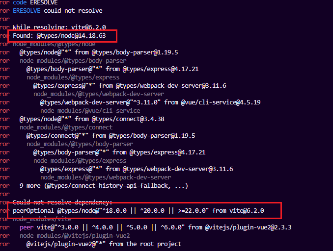
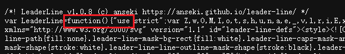

# webpack迁移到vite

## 安装依赖

```
npm install -D vite@5 #vue2项目中vite@6会有版本冲突
npm install @vitejs/plugin-vue2
npm install @vitejs/plugin-vue2-jsx
```

安装@vitejs/plugin-vue2插件时报错：@types/node版本过低



安装新版本`@types/node`

```
npm install  @types/node@20
```

## 配置vite.config.js文件
```
import { defineConfig, loadEnv } from 'vite'
import vue from '@vitejs/plugin-vue2'
import jsx from '@vitejs/plugin-vue2-jsx'
import path from 'path'

function resolve(url) {
  return path.resolve(__dirname, url)
}

export default defineConfig(({ command, mode, isSsrBuild, isPreview }) => {

  const env = loadEnv(mode, process.cwd(), '')

  return {
    base: '/',
    define: {
      'process.env': env,
      global: 'window',
    },
    plugins: [
      vue(),
      jsx(),
    ],
    resolve: {
      alias: {
        '@': resolve('src'),
        'components': resolve('src/components'),
      },
      extensions: ['.mjs', '.js', '.ts', '.jsx', '.tsx', '.json', '.vue'],
    },
    css: {
        // 插入配置scss全局变量，否则组件中无法识别找到scss变量
    	preprocessorOptions: {
            scss: {
                additionalData: '@import "element-cisdi/packages/theme-chalk/src/patch/common/var.scss"; ',
            },
      },
    },
    server: {
      open: true,
      port: 8092,
      proxy: {
        '/mock': {
          target: env.VITE_APP_API_URL,
          changeOrigin: true,
          pathRewrite: {
            '^/mock': '',
          },
        },
      },
    },
  }
})

```


## 修改环境变量

将`VUE`前缀改为`VITE`, vite只能识别VITE前缀的环境变量
``` 
VUE_APP_MODE = development // [!code --]
VUE_APP_API_URL = 'https://xxx' // [!code --]

VITE_APP_MODE = development // [!code ++]
VITE_APP_API_URL = 'https://xxx' // [!code ++]

```

## index.html移到根目录

将index.html从public移到项目根目录，并且修改资源引入的路径，以及引入`/src/main.js`文件。

```
<!DOCTYPE html>
<html lang="">
  <head>
    <meta charset="utf-8" />
    <meta http-equiv="X-UA-Compatible" content="IE=edge" />
    <meta name="viewport" content="width=device-width,initial-scale=1.0" />
    <link rel="icon" href="/favicon.ico" />
    <title>imc-device-rigang-web</title>
    <script src="/jessibuca-pro.js"></script>
    <script src="/ZLMRTCClient.js"></script>
    <script src="/webrtc/libs/adapter.min.js"></script>
    <script src="/webrtc/webrtcstreamer.js"></script>
  </head>
  
  <body>
    <!-- <script src="./web/demoutils.js"></script> -->
    
    <noscript>
      <strong
        >We're sorry but imc-device-rigang-web doesn't work
        properly without JavaScript enabled. Please enable it to
        continue.</strong
      >
    </noscript>
    <div id="app"></div>
    <script type="module" src="/src/main.js"></script> // [!code ++]
    <!-- built files will be auto injected -->
  </body>
  <style>
    html {
      overflow: hidden;
    }

    .amap-logo {
      display: none;
      opacity: 0 !important;
    }

    .amap-copyright {
      opacity: 0;
    }
  </style>
</html>

```

## require 报错处理

方法 `require()`

Node.JS 原生方法 ，以 CommonJS 方式加载模块/文件/图片；

Webpack 默认支持 ，Vite 不支持；

方法 `require.context()`

Webpack 特定方法，此方法可实现自定义上下文；

Vite 不支持；

## css导入写法修改

`~`符号是webpack的语法，vite中需要去掉

```css
@import "~@/assets/fonts/iconfont.css"; // webpack环境

@import "@/assets/fonts/iconfont.css"; // vite环境
```

## 修改不兼容esm的依赖导入方式

例如：leader-line只导出了umd格式的引用方式


方案:使用 <script> 标签 + 全局变量

在 index.html 中通过 CDN 或本地脚本引入

```html
<!-- index.html（Vite 项目根目录） -->
<script src="https://cdn.jsdelivr.net/npm/leader-line@1/leader-line.min.js"></script>
```

组件中即可直接使用LeaderLine函数


## vite.config.js示例

```js
import { defineConfig, loadEnv } from 'vite'
import vue from '@vitejs/plugin-vue2'
import jsx from '@vitejs/plugin-vue2-jsx'
import path from 'path'
import legacy from '@vitejs/plugin-legacy'

function resolve(url) {
  return path.resolve(__dirname, url)
}

export default defineConfig(({ command, mode, isSsrBuild, isPreview }) => {

  const env = loadEnv(mode, process.cwd(), '')
  const isProduction = process.env.NODE_ENV === 'production'

  return {
    // 部署路径为web
    base: isProduction ? '/web/' : '/',
    define: {
      'process.env': env,
      global: 'window',
    },
    plugins: [
      vue(),
      jsx(),
      legacy({
        targets: ['ie >= 11'],
        additionalLegacyPolyfills: ['regenerator-runtime/runtime'],
      }),
    ],
    resolve: {
      alias: {
        '@': resolve('src'),
        'components': resolve('src/components'),
      },
      extensions: ['.mjs', '.js', '.ts', '.jsx', '.tsx', '.json', '.vue'],
    },
    build: {
      target: 'es2015',
    },
    server: {
      port: 8888,
      open: true,
      proxy: {
      },
    },
  }
})

```