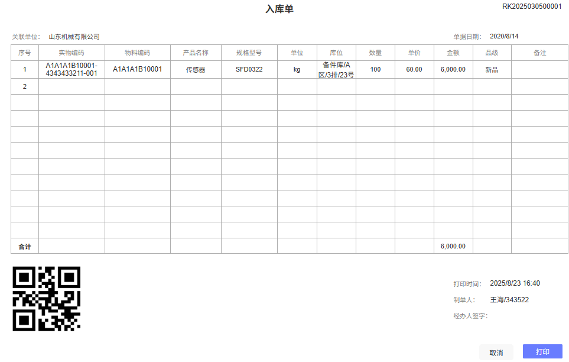

# Print.js实现单据打印

## 需求场景

实现如下图的入库单打印



## 实现方案

在还原打印单页面效果时，最好使用原生table来编写，因为el-table打印后出现列错位等样式问题，并且由于el-table样式层级过多，不易调试。

注意：在使用html格式打印时，打印元素中有图片时，必须保证图片引用正确可显示，否则会造成打印功能无反应。

``` js
printJS({
        printable: 'print-content', // 打印元素id
        type: 'html', // 打印格式
        documentTitle: '入库单', // 文件名
        scanStyles: false, // 不扫描组件中的样式，只使用style样式
        // 编写打印页面样式
        style: ` 
          @page {
            margin: 5mm 0; // 页面内边距
            size: A4;
          }
          
          * {
            margin: 0;
            padding: 0;
            box-sizing: border-box;
          }
          
          body {
            font-family: "Microsoft YaHei", Arial, sans-serif;
            font-size: 12px;
            color: #000;
            line-height: 1.4;
          }
          
          #print-content {
            width: 100%;
            padding: 20px;
            background: white;
            color: #000;
          }
          
          .print-header {
            position: relative;
            margin-bottom: 25px;
            text-align: center;
            padding-bottom: 15px;
          }
          
          .print-title {
            font-size: 22px;
            font-weight: bold;
            margin: 0 0 15px 0;
            color: #000;
          }
          
          .document-number {
            position: absolute;
            top: 5px;
            right: 0;
            font-size: 12px;
            color: #000;
          }
          
          .basic-info {
            margin-bottom: 20px;
            padding: 10px 0;
          }
          
          .info-row {
            font-size: 12px;
            line-height: 1.5;
            color: #000;
          }
          
          .label {
            font-weight: normal;
            color: #000;
          }
          
          .value {
            color: #000;
            margin-right: 30px;
          }
          
          .right-label {
            margin-left: 400px;
          }
          
          .table-wrapper {
            margin-bottom: 25px;
          }
          
          .print-table {
            width: 100%;
            border-collapse: collapse;
            border: 1px solid #dcdfe6;
            font-size: 11px;
            font-family: "Microsoft YaHei", Arial, sans-serif;
          }
          
          .print-table th,
          .print-table td {
            border: 1px solid #dcdfe6;
            padding: 6px 4px;
            text-align: center;
            vertical-align: middle;
            word-wrap: break-word;
            height: 30px;
            line-height: 1.2;
          }
          
          .print-table th {
            font-weight: bold;
            color: #000;
            font-size: 10px;
          }
          
          .print-table td {
            background-color: #fff;
            color: #000;
            font-size: 9px;
          }
          
          .print-table th:first-child,
          .print-table td:first-child {
            width: 40px;
          }
          
          .print-table th:nth-child(2),
          .print-table td:nth-child(2) {
            width: 130px;
            font-size: 8px;
          }
          
          .print-table th:nth-child(3),
          .print-table td:nth-child(3) {
            width: 100px;
            font-size: 8px;
          }
          
          .print-table th:nth-child(4),
          .print-table td:nth-child(4) {
            width: 70px;
          }
          
          .print-table th:nth-child(5),
          .print-table td:nth-child(5) {
            width: 70px;
            font-size: 8px;
          }
          
          .print-table th:nth-child(6),
          .print-table td:nth-child(6) {
            width: 35px;
          }
          
          .print-table th:nth-child(7),
          .print-table td:nth-child(7) {
            width: 110px;
            font-size: 8px;
          }
          
          .print-table th:nth-child(8),
          .print-table td:nth-child(8) {
            width: 50px;
          }
          
          .print-table th:nth-child(9),
          .print-table td:nth-child(9) {
            width: 60px;
          }
          
          .print-table th:nth-child(10),
          .print-table td:nth-child(10) {
            width: 80px;
          }
          
          .print-table th:nth-child(11),
          .print-table td:nth-child(11) {
            width: 50px;
          }
          
          .print-table th:nth-child(12),
          .print-table td:nth-child(12) {
            width: 60px;
          }
          
          .total-row td {
            font-weight: bold;
            background-color: #f8f9fa;
          }
          
          .total-label {
            font-weight: bold;
            color: #000;
          }
          
          .total-amount {
            font-weight: bold;
            color: #000;
            font-size: 10px;
          }
          
          .print-footer {
            margin-top: 30px;
            padding-top: 20px;
            position: relative;
            min-height: 140px;
          }
          
          .qr-code-section {
            float: left;
            width: 150px;
          }
          
          .qr-code img {
            width: 120px;
            height: 120px;
          }
          
          .footer-info {
            float: right;
            text-align: left;
          }
          
          .info-item {
            margin-bottom: 12px;
            font-size: 12px;
            line-height: 1.5;
            color: #000;
          }
          
          .info-item .label {
            font-weight: normal;
            display: inline-block;
            width: 80px;
            color: #000;
          }
          
          .info-item .value {
            color: #000;
          }
          
          .signature-line {
            display: inline-block;
            width: 100px;
            height: 1px;
            border-bottom: 1px solid #dcdfe6;
            margin-left: 5px;
            vertical-align: bottom;
          }
          
          .print-footer::after {
            content: "";
            display: table;
            clear: both;
          }
        `,
        onPrintDialogClose: () => {
          this.printBtnLoading = false
        }, // 打印弹框关闭后的回调
      })

```

