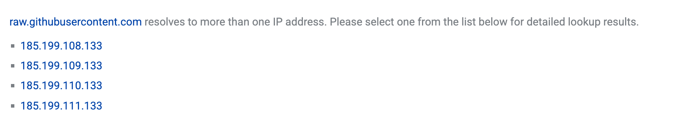

# macos 安装nodejs.md

## 解决raw.githubusercontent.com地址443问题

在使用命令行安装nodejs时，github链接超时。

执行如下命令：
curl -o- https://raw.githubusercontent.com/nvm-sh/nvm/v0.40.3/install.sh | bash

报错：
Failed to connect to raw.githubusercontent.com port 443: Connection refused

原因与解决方案：
只是因为raw.githubusercontent.com被墙了，我们需要配置本地hosts。
使用https://www.ipaddress.com/ip-lookup 查看IP地址

在访达中执行shift+cmd+G， 查找/private文件夹， 然后在etc/hosts中添加IP映射，然后保存hosts文件即可。

185.199.108.133 raw.githubusercontent.com

185.199.109.133 raw.githubusercontent.com

185.199.110.133 raw.githubusercontent.com

185.199.111.133 raw.githubusercontent.com

