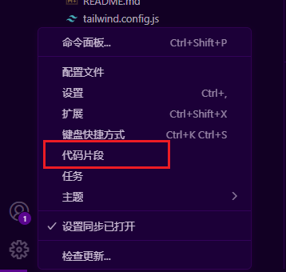

# vscode定义代码片段



这里我们新增一个react函数组件代码片段。

需求：组件名称使用文件名，可以使用vscode内置的代码变量，如TM_FILENAME_BASE表示文件名（不含后缀）

代码变量文档：https://code.visualstudio.com/docs/editing/userdefinedsnippets#_variables

```
{
	"Print to console": {
		"prefix": "efc",
		"body": [
			"interface ${TM_FILENAME_BASE}Props {",
			"  title: string;",
			"}",
			"",
			"export default function $TM_FILENAME_BASE({ title }: ${TM_FILENAME_BASE}Props) {",
			"  return <div>{title}</div>;",
			"}",
		],
		"description": "create a react function component"
	}
}
```